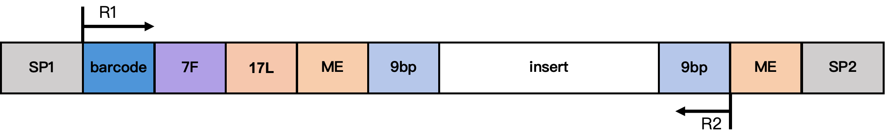
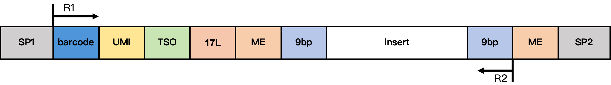
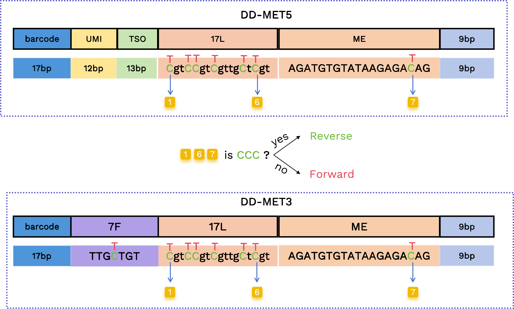
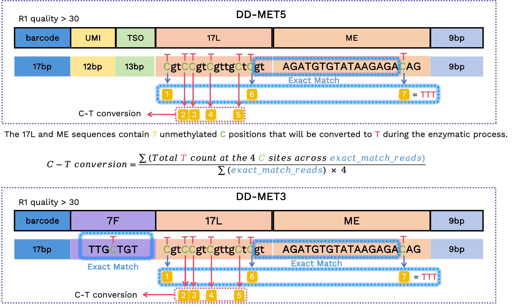
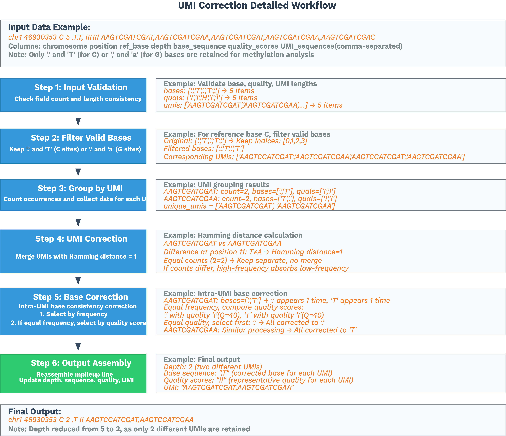

# SeekSoulMethyl
SeekSoul™ Methyl Tools（SeekSoulMethyl）是一个单细胞转录组 + 甲基化分析流程，旨在分析使用北京[寻因生物](https://www.seekgene.com/)科技有限公司 SeekOne DD 单细胞多组学甲基化 + RNA 试剂盒产生的数据。

## 数据结构
SeekOne DD 单细胞多组学甲基化 + RNA 试剂盒包含两种建库方案。DD-MET3（双标签）表示同一细胞的 RNA 和 DNA 甲基化数据 barcode 不同，RNA 文库为 3' 端转录组文库。DD-MET5（单标签）表示同一细胞的 RNA 和 DNA 甲基化数据 barcode 相同，RNA 文库为 5' 端转录组文库。下面分别介绍两种建库方案的 DNA 甲基化文库结构。

**DD-MET3 甲基化文库结构**
<figure style="text-align: center;">

<figcaption style="font-size: 0.95em; color: #666; margin-top: 4px;">图 1. DD-MET3 甲基化文库结构</figcaption>
</figure>

结构说明：
- SP1/SP2：接头序列
- barcode：17 bp 细胞 barcode
- 7F：7 bp 连接序列
- 17L：17 bp 固定序列 **C**gt**CC**gt**C**gttg**C**t**C**gt
- ME：19 bp 固定序列 AGATGTGTATAAGAGA**C**AG
- 9 bp：Tn5 插入片段的延伸序列

**DD-MET5 甲基化文库结构**
<figure style="text-align: center;">

<figcaption style="font-size: 0.95em; color: #666; margin-top: 4px;">图 2. DD-MET5 甲基化文库结构</figcaption>
</figure>

结构说明：
- SP1/SP2：接头序列
- barcode：17 bp 细胞 barcode
- UMI：12 bp UMI 序列
- TSO：13 bp TSO 序列 TTT**C**TTATATGGG
- 17L：17 bp 固定序列 **C**gt**CC**gt**C**gttg**C**t**C**gt
- ME：19 bp 固定序列 AGATGTGTATAAGAGA**C**AG
- 9 bp：Tn5 插入片段的延伸序列

由于酶处理会将未甲基化的胞嘧啶（C）转换为胸腺嘧啶（T），SP1 和 SP2 中的 C 碱基经过甲基化修饰，以防止在转换过程中引入测序接头错误。此外，甲基化数据所用的 barcode 不包含任何 C 碱基。相比之下，7F、17L 和 ME 中的 C 碱基未经甲基化修饰，在酶处理过程中会被转换为 T；我们利用这些固定序列来计算 C-to-T 转换率。

## 安装

1. 克隆仓库：
```bash
git clone https://github.com/seekgene/SeekSoulMethyl.git
cd SeekSoulMethyl
```

2. 创建并激活 conda 环境：

中国用户：
```bash
conda env create -n seeksoulmethyl -f conda_dependencies.zh.yml
conda activate seeksoulmethyl
```

国际用户：
```bash
conda env create -n seeksoulmethyl -f conda_dependencies.yml
conda activate seeksoulmethyl
```

3. 安装软件包：
```bash
cd dependence
pip install . \
  simpleqc/target/wheels/simpleqc-0.1.0-py3-none-manylinux_2_17_x86_64.manylinux2014_x86_64.whl \
  search-pattern/target/wheels/search_pattern-0.1.0-py3-none-manylinux_2_5_x86_64.manylinux1_x86_64.whl
cd ..

```
我们将下载经过修改的 Bismark 和 ALLCools 版本用于分析。

- [Bismark](https://github.com/seekgene/Bismark.git) 在 BAM 文件中添加了 CB（纠错后 barcode）标签和 UR（原始 UMI）标签。
- [ALLCools](https://github.com/seekgene/ALLCools.git) 基于 UR 标签进行 UMI 去重和甲基化水平计算。

```shell
# 克隆并安装自定义 ALLCools
conda activate seeksoulmethyl
git clone https://github.com/seekgene/ALLCools.git && \
pip install ./ALLCools && \
rm -rf ./ALLCools

# 克隆并安装自定义 Bismark
git clone https://github.com/seekgene/Bismark.git && \
bin_path=$(dirname `which python`)
cp -r ./Bismark/* $bin_path/ && \
    chmod +x $bin_path/bismark* && \
    chmod +x $bin_path/deduplicate_bismark && \
    rm -rf ./Bismark

```

## 下载参考数据库
```bash
# 下载人类参考基因组（GRCh38）
wget -c -O human-reference-GRCh38.tar.gz "https://seekgene-public.oss-cn-beijing.aliyuncs.com/methy_demo/methy_exp/v1.1/human-reference-GRCh38.tar.gz"
wget -c -O human-reference-GRCh38.tar.gz.md5 "https://seekgene-public.oss-cn-beijing.aliyuncs.com/methy_demo/methy_exp/v1.1/human-reference-GRCh38.tar.gz.md5"

# 下载小鼠参考基因组（GRCm39）
wget -c -O mouse-reference-GRCm39.tar.gz "https://seekgene-public.oss-cn-beijing.aliyuncs.com/methy_demo/methy_exp/v1.1/mouse-reference-GRCm39.tar.gz"
wget -c -O mouse-reference-GRCm39.tar.gz.md5 "https://seekgene-public.oss-cn-beijing.aliyuncs.com/methy_demo/methy_exp/v1.1/mouse-reference-GRCm39.tar.gz.md5"

# 解压参考基因组
tar -xzf human-reference-GRCh38.tar.gz
tar -xzf mouse-reference-GRCm39.tar.gz
```

## 下载测试数据（可选）
如需使用小数据集测试流程，可下载以下测试数据：

```bash
# 下载转录组测试数据
wget -c -O XYRD-WTJW880-E_S1_L005_R1_001.fastq.gz "https://seekgene-public.oss-cn-beijing.aliyuncs.com/methy_demo/methy_exp/fastq/XYRD-WTJW880-E_S1_L005_R1_001.fastq.gz"
wget -c -O XYRD-WTJW880-E_S1_L005_R1_001.fastq.gz.md5 "https://seekgene-public.oss-cn-beijing.aliyuncs.com/methy_demo/methy_exp/fastq/XYRD-WTJW880-E_S1_L005_R1_001.fastq.gz.md5"
wget -c -O XYRD-WTJW880-E_S1_L005_R2_001.fastq.gz "https://seekgene-public.oss-cn-beijing.aliyuncs.com/methy_demo/methy_exp/fastq/XYRD-WTJW880-E_S1_L005_R2_001.fastq.gz"
wget -c -O XYRD-WTJW880-E_S1_L005_R2_001.fastq.gz.md5 "https://seekgene-public.oss-cn-beijing.aliyuncs.com/methy_demo/methy_exp/fastq/XYRD-WTJW880-E_S1_L005_R2_001.fastq.gz.md5"

# 下载甲基化测试数据
wget -c -O XYRD-WTJW880-MET_S01_L001_R1_001.fastq.gz "https://seekgene-public.oss-cn-beijing.aliyuncs.com/methy_demo/methy_exp/tiny_fastq/XYRD-WTJW880-MET_S01_L001_R1_001.fastq.gz"
wget -c -O XYRD-WTJW880-MET_S01_L001_R1_001.fastq.gz.md5 "https://seekgene-public.oss-cn-beijing.aliyuncs.com/methy_demo/methy_exp/tiny_fastq/XYRD-WTJW880-MET_S01_L001_R1_001.fastq.gz.md5"
wget -c -O XYRD-WTJW880-MET_S01_L001_R2_001.fastq.gz "https://seekgene-public.oss-cn-beijing.aliyuncs.com/methy_demo/methy_exp/tiny_fastq/XYRD-WTJW880-MET_S01_L001_R2_001.fastq.gz"
wget -c -O XYRD-WTJW880-MET_S01_L001_R2_001.fastq.gz.md5 "https://seekgene-public.oss-cn-beijing.aliyuncs.com/methy_demo/methy_exp/tiny_fastq/XYRD-WTJW880-MET_S01_L001_R2_001.fastq.gz.md5"


```

**注意**：这是用于流程验证的小型测试数据集。正式分析请使用您自己的测序数据。

## 仓库结构

克隆后，关键的 Nextflow 入口文件和模块如下：

- `nf/main.nf`：顶层入口。通过 `--workflow` 选择子工作流（`rna_met`、`methy_only`、`force_cell`）。
- `nf/subworkflows/`：工作流定义：
  - `rna_met/main.nf`：转录组 + 甲基化端到端处理。
  - `met_only/main.nf`：仅甲基化工作流。
  - `forcecell/main.nf`：Force-cell 工作流（使用先前输出重新计算/更新结果）。
- `nf/modules/`：分步处理模块：
  - `step1.nf` 预处理、质控、barcode 提取、转录组分析。
  - `step2.nf` Bismark 比对和 BAM 排序。
  - `step3.nf` 按细胞拆分 BAM、ALLC 生成/合并、多尺度数据集。
  - `step4.nf` 汇总统计、降维、联合报告。
  - `utils.nf` 仅甲基化工作流的辅助工具（reads 计数和细胞估算）。
- `nf/bin/`：辅助脚本和资源文件（如 barcode 白名单）。
- `nf/nextflow.config`：执行器和资源配置。
- `nf/nextflow_schema.json`：流程参数 schema。
- `sc_methy_workflow.sh`：运行双组学分析流程的 Shell 脚本。

我们提供两种数据分析方法：

1. **Shell 脚本**：通过 `sc_methy_workflow.sh` 脚本直接运行分析流程。
2. **Nextflow 流程**：通过 `nf/main.nf` 运行 Nextflow 流程。

两种方法的详细说明如下。

## 使用方法

### 激活环境
```bash
conda activate seeksoulmethyl
```

### 运行双组学分析（Shell 脚本）
```bash
# sc_methy_workflow.sh 位于您克隆的 SeekSoulMethyl 目录下
bash sc_methy_workflow.sh \
/path/to/expression_R1.fastq.gz \
/path/to/expression_R2.fastq.gz \
/path/to/methy_R1.fastq.gz \
/path/to/methy_R2.fastq.gz \
--sample WTJW880 \
--outdir /path/to/results \
--database_dir /path/to/human-reference-GRCh38 \
--chemistry DD-MET5 \
--core 64 \
--filter_ch 2
```
如果一个样本有多组数据，请用逗号分隔文件路径。请确保各组数据的 FASTQ 文件按正确顺序排列。
```shell
bash sc_methy_workflow.sh \
/path/to/WTJW969_E_L003_R1.fq.gz,/path/to/WTJW969_E_L004_R1.fq.gz \
/path/to/WTJW969_E_L003_R2.fq.gz,/path/to/WTJW969_E_L004_R2.fq.gz \
/path/to/WTJW969_Met_L000_R1.fq.gz,/path/to/WTJW969_Met_L001_R1.fq.gz,/path/to/WTJW969_Met_L002_R1.fq.gz,/path/to/WTJW969_Met_L003_R1.fq.gz,/path/to/WTJW969_Met_L004_R1.fq.gz \
/path/to/WTJW969_Met_L000_R2.fq.gz,/path/to/WTJW969_Met_L001_R2.fq.gz,/path/to/WTJW969_Met_L002_R2.fq.gz,/path/to/WTJW969_Met_L003_R2.fq.gz,/path/to/WTJW969_Met_L004_R2.fq.gz \
--sample WTJW969 \
--outdir /path/to/results \
--database_dir /path/to/human-reference-GRCh38 \
--chemistry DD-MET5 \
--core 64 \
--filter_ch 2
```

### 输入参数：

- **$1**：单细胞转录组 Read1 fastq 文件路径。
- **$2**：单细胞转录组 Read2 fastq 文件路径。
- **$3**：单细胞甲基化 Read1 fastq 文件路径。
- **$4**：单细胞甲基化 Read2 fastq 文件路径。
- **sample**：样本名称。
- **outdir**：输出目录路径。
- **database_dir**：参考基因组数据库路径。
- **chemistry**：甲基化建库方案（DD-MET3 或 DD-MET5；默认值：DD-MET5）。DD-MET3 为双标签数据集，表示同一细胞的 RNA 和 DNA 甲基化数据 barcode 不同；DD-MET5 为单标签，表示同一细胞的 RNA 和 DNA 甲基化数据 barcode 相同。
- **core**：CPU 核心数。
- **filter_ch**：过滤包含 > n 个 CH 甲基化位点的 reads。如果不需要启用此过滤，请将 filter_ch 设置为 0。

## 流程详情
### 转录组处理工作流
转录组数据使用 [SeekSoulTools](https://github.com/seekgene/SeekSoulMethyl/tree/nf_rna_methy/dependence/seeksoultools) 进行分析。详细步骤请参阅官方[算法概述](http://seeksoul.seekgene.com/en/v1.3.0/2.tutorial/1.rna/4.description.html)。下游甲基化文库使用的细胞由转录组文库的细胞 barcode 确定。

### 甲基化处理工作流
#### 步骤 1：预处理与 Barcode 解析
**Barcode 提取与纠错**

根据设计的文库结构，我们在 read 中定位 barcode 并提取相应序列。如果提取的 barcode 存在于白名单中，则计为有效 barcode；否则，SeekSoulMethyl 将尝试进行 barcode 纠错，前提是该 barcode 与白名单中的某个条目仅有一个碱基的差异（汉明距离 = 1）：
* 如果恰好有一个白名单候选匹配：将无效 barcode 纠正为该白名单 barcode。
* 如果有多个白名单候选匹配：纠正为 read 计数最高的候选。

如果纠错失败，该 read 将被丢弃，视为最终无效 barcode read。

**UMI 提取**

根据设计结构中的 UMI 位置直接提取 UMI 序列，不进行纠错。

**Forward 和 Reverse reads 判定**

在 17L 和 ME 对应位置中，有 7 个碱基可能为 C 或转换后的 T（如下高亮所示）。我们使用第一个和最后两个 C/T 位置来判定 forward 与 reverse reads：如果三个位置均为 C，则判定为 reverse read；否则判定为 forward read。

- Forward：**T**gt**TT**gt**T**gttg**T**t**T**gtAGATGTGTATAAGAGA**T**

- Reverse：**C**gt**CC**gt**C**gttg**C**t**C**gtAGATGTGTATAAGAGA**C**

Reverse reads 对应甲基化术语中的 CTOT/CTOB（原始链的反向互补链）；forward reads 对应 OT/OB（原始链）。
"forward"或"reverse"的判定结果标注在 read name 中。

<figure style="text-align: center;">

<figcaption style="font-size: 0.95em; color: #666; margin-top: 4px;">图 3. Forward 和 Reverse reads 判定</figcaption>
</figure>

**C–T 转换率**

我们利用 17L 和 ME 序列中原始 C 位置来计算 C-to-T 转换率。由于这些是容易出现测序错误的固定序列，我们仅对结构验证通过的 reads 进行计算：

 - 在 DD-MET3 中，7F 序列必须为 `TTGCTGT` 或 `TTGTTGT`，17L 和 ME 跨区域的序列必须为 `GTAGATGTGTATAAGAGA`，且第一个和最后两个原始 C 位置的碱基必须为 T。
 
 - 在 DD-MET5 中，17L 和 ME 跨区域的序列必须为 `GTAGATGTGTATAAGAGA`，且第一个和最后两个原始 C 位置的碱基必须为 T。

对于保留的 reads，我们提取相应位置的碱基来计算 C-to-T 转换率：

<figure style="text-align: center;">

<figcaption style="font-size: 0.95em; color: #666; margin-top: 4px;">图 4. CT 转换率</figcaption>
</figure>

> [!NOTE]
> 以上过滤步骤仅用于计算 C-to-T 转换率；不满足这些条件的 reads 不会从最终输出的 FASTQ 文件中过滤掉。

**人工序列去除**

根据文库设计中的预定义位置，从 Read1 中去除 TSO/7F 连接序列、17L 和 ME 序列。

**接头修剪**

使用 cutadapt 去除因 R1/R2 read-through 事件（双端测序 reads 重叠）引入的 ME 接头序列。

**修剪 Tn5 转座酶引入的 9 bp 间隔**

在去除接头和其他人工序列后，我们额外修剪 Tn5 转座引入的插入片段两侧的 9 bp 间隔区域。这些 9 bp 区域可能携带人工甲基化信号，并在插入边界附近虚假地提高 CH 甲基化水平，因此在下游分析前予以去除。

**过滤含有过多非 CpG 甲基化 C 碱基的 reads（可选）**

根据 read pair 中非 CpG 甲基化 C 碱基的数量进行过滤。默认情况下，read1/read2 中检测到 > 2 个非 CpG 甲基化 C 的 read pair 将被去除。如果不需要启用此过滤，请将 filter_ch 设置为 0。

> [!NOTE]
> 此过滤策略基于 Lu 等人 [1] 的研究发现，该研究表明合成接头中的切口（nick）可触发 Bst 聚合酶的切口平移活性。该活性会掺入 5-甲基-dCTP，导致完全未转换的 reads，表现为人工甲基化信号。

**过滤过短 reads**
经过前述过滤和接头修剪步骤后，如果 read pair 中 R1 的长度小于 20 bp 或 R2 的长度小于 60 bp，则该 read pair 将被过滤掉。

#### 步骤 2：Bismark 比对与按名称排序
**比对与标签添加**

我们使用 Bismark 进行甲基化比对。我们修改的 [Bismark](https://github.com/seekgene/Bismark.git) 添加了 `--add_barcode` 和 `--add_umi` 参数，通过 read name 在 BAM 文件中标记 CB（纠错后 barcode）和 UR（原始 UMI）。对于 forward reads，我们使用 `-X 1000` 允许最大插入片段长度为 1000 bp；对于 reverse reads，我们使用 `--pbat` 和 `-X 1000`。
比对完成后，使用 `samtools sort -n` 按 read name 排序 BAM 文件；按名称排序的 BAM 文件作为下游分析的输入。

#### 步骤 3：ALLCools 分析

**按细胞 barcode 拆分**

将按名称排序的 BAM 文件按 RNA 来源的细胞 barcode 拆分为单细胞 BAM 文件，每个文件包含一个细胞的唯一比对 reads。

**生成 ALLC 文件**

将每个单细胞 BAM 文件按位置排序，并使用 ALLCools `bam-to-allc` 转换为 ALLC 格式。我们修改的 ALLCools 基于 UR 标签对每个 C 位点进行 UMI 纠错和去重。

<figure style="text-align: center;">

<figcaption style="font-size: 0.95em; color: #666; margin-top: 4px;">图 5. UMI 纠错详细流程图</figcaption>
</figure>

详细信息请参阅 [SeekGene ALLCools 仓库](https://github.com/seekgene/ALLCools)。

**生成 MCDS**

运行 `allcools generate-dataset` 对基因组进行分箱（chrom10k/20k/50k/100k/500k/1M/geneslop2k），并计算单细胞甲基化矩阵。geneslop2k 分箱定义为每个基因两侧各延伸 2k bp 的区域。

#### 步骤 4：降维与聚类
默认使用 ALLCools 对 chrom20k 分箱进行 LSI 降维，随后进行 UMAP 可视化。

### 系统要求
如果使用 `sc_methy_workflow.sh`，系统要求如下：
- **CPU**：64 核（推荐）
- **内存**：128GB RAM（推荐）
- **操作系统**：Linux（推荐 Ubuntu 18.04+ 或 CentOS 7+）

## 使用 Nextflow 运行（推荐）

如果需要批量处理样本并获取流程级报告，请使用 Nextflow：

<figure style="text-align: center;">

<figcaption style="font-size: 0.95em; color: #666; margin-top: 4px;">图 6. SeekSoulMethyl Nextflow 流程工作流</figcaption>
</figure>

1. 安装 Nextflow：
```bash
conda install -n seeksoulmethyl -c bioconda nextflow
```
2. 准备输入样本表
```
cat > samplelist.csv << EOF
sample_id,expression_r1,expression_r2,methylation_r1,methylation_r2
XYRD-WTJW880,/path/to/XYRD-WTJW880-E_S1_L005_R1_001.fastq.gz,/path/to/XYRD-WTJW880-E_S1_L005_R2_001.fastq.gz,/path/to/XYRD-WTJW880-MET_S01_L001_R1_001.fastq.gz,/path/to/XYRD-WTJW880-MET_S01_L001_R2_001.fastq.gz
EOF

# expression_r1：单细胞转录组 Read1 fastq 文件
# expression_r2：单细胞转录组 Read2 fastq 文件
# methylation_r1：单细胞甲基化 Read1 fastq 文件
# methylation_r2：单细胞甲基化 Read2 fastq 文件
```

如果单个样本有多组数据，且转录组和甲基化的 FASTQ 数量不匹配（例如 WTJW969），请在样本表中添加多行，每行代表一组数据。
```text
sample_id,expression_r1,expression_r2,methylation_r1,methylation_r2
WTJW969,/path/to/WTJW969_E_L003_R1.fq.gz,/path/to/WTJW969_E_L003_R2.fq.gz,/path/to/WTJW969_Met_L000_R1.fq.gz,/path/to/WTJW969_Met_L000_R2.fq.gz
WTJW969,/path/to/WTJW969_E_L004_R1.fq.gz,/path/to/WTJW969_E_L004_R2.fq.gz,/path/to/WTJW969_Met_L001_R1.fq.gz,/path/to/WTJW969_Met_L001_R2.fq.gz
WTJW969,,,/path/to/WTJW969_Met_L002_R1.fq.gz,/path/to/WTJW969_Met_L002_R2.fq.gz
WTJW969,,,/path/to/WTJW969_Met_L003_R1.fq.gz,/path/to/WTJW969_Met_L003_R2.fq.gz
WTJW969,,,/path/to/WTJW969_Met_L004_R1.fq.gz,/path/to/WTJW969_Met_L004_R2.fq.gz
```

3. 运行流程：
```bash
nextflow run -bg SeekSoulMethyl/nf/main.nf \
--outdir /path/to/tiny_demo/results/ \
--samplesheet samplelist.csv \
-w /path/to/tiny_demo/results/work \
-c SeekSoulMethyl/nf/nextflow.config \
-profile aliyun_k8s \
--database_dir /path/to/human-reference-GRCh38/ \
--split_fastq 1 \
--filter_ch 2 \
--chemistry DD-MET5 > methy.log

# --outdir：最终结果目录
# --samplesheet：输入样本表文件
# -w：Nextflow 工作目录
# -c：Nextflow 配置文件。必须根据您的服务器配置进行修改。
# -profile：阿里云 K8s 的 Nextflow profile
# --database_dir：参考基因组数据库目录
# --split_fastq：为加速分析过程，根据 barcode 前 n 个碱基拆分 fastq。默认值为 4。
# --filter_ch：过滤包含 > 2 个 CH 甲基化位点的 reads。
# --expected_cell_num：methy_only 细胞估计使用的预期细胞数。默认值为 3000。
# --chemistry：甲基化建库方案（DD-MET3 或 DD-MET5；默认值：DD-MET5）
```

### nextflow.config 说明

`nextflow.config` 声明了执行环境、资源配额和运行策略。您必须根据自己的服务器或集群进行自定义配置。

- 位置：`SeekSoulMethyl/nf/nextflow.config`（运行时通过 `-c SeekSoulMethyl/nf/nextflow.config` 指定）。
- 需要根据您的基础设施调整的关键配置项：
  - 执行器：`process.executor`（例如 `local`、`slurm`、`pbs`、`k8s`、`awsbatch`）。
  - 资源：`process.cpus`、`process.memory`、`process.time`，或通过 `withLabel`/`withName` 进行细粒度配置。
  - 工作目录：`workDir`（也可通过 `-w` 设置）；确保该目录可写且有足够空间。
  - 环境：根据您的服务器支持情况，启用 `conda.enabled`、`docker.enabled` 或 `singularity.enabled` 之一。

示例配置（请将路径和参数替换为您服务器上的有效值）：

```groovy
profiles {
  // 本地机器
  local {
    process.executor = 'local'
    workDir          = '/path/to/work'
    process.cpus     = 8
    process.memory   = '32 GB'
    conda.enabled    = true
    // 或使用容器：singularity.enabled = true / docker.enabled = true
  }

  // Slurm 集群（HPC）
  slurm {
    process.executor   = 'slurm'
    workDir            = '/lustre/work/your_user'
    process.cpus       = 8
    process.memory     = '32 GB'
    process.queue      = 'normal'
    process.clusterOptions = '-A your_account --qos=normal'

    withLabel: 'high_mem' {
      cpus   = 16
      memory = '64 GB'
    }
  }

  // Kubernetes（例如阿里云 ACK）
  aliyun_k8s {
    process.executor   = 'k8s'
    workDir            = '/mnt/nf-work'    // 持久化存储卷路径
    k8s {
      namespace        = 'your-namespace'
      storageClaimName = 'your-pvc'
      cpu              = 4
      memory           = '16 GB'
    }
    // 如果全局使用容器镜像：docker.enabled = true
  }
}
```

提示：
- 选择与您环境匹配的 `-profile`（例如 `slurm`、`local`、`aliyun_k8s`），然后调整相应参数。
- 将 `workDir` 设置在具有足够容量的高速存储上；最终结果目录由 `--outdir` 控制。
- 如果使用 README 中的 conda 环境，建议启用 `conda.enabled`；如果您的集群使用容器，请使用 Docker/Singularity。

参考文档：
- Nextflow 配置与 profiles：https://www.nextflow.io/docs/latest/config.html
- 执行器（local、Slurm、K8s 等）：https://www.nextflow.io/docs/latest/executor.html
- Kubernetes 指南：https://www.nextflow.io/docs/latest/kubernetes.html

## Nextflow 分步详情

本节描述每个 Nextflow 进程的输入、核心逻辑、关键参数和输出，便于故障排除和结果解读。工作流定义在 `nf/main.nf` 中，进程实现在 `nf/modules/*.nf` 中。

### 步骤 1：预处理与 Barcode 解析（step1.nf）
- 计算全基因组 CpG 位点数：`COMPUTE_CPG_SITES`
  - 输入：`params.genomefa`、`params.chrom_size_path`
  - 操作：运行 `count_cg_sites.py` 统计 CpG 位点
  - 输出：`genome_cg_info.json`

- 转录组 FASTQ 质控（多组）：`FASTP_EXPRESSION_MULTI`
  - 输入：每个样本的双端 FASTQ（G1/G2/... 组）
  - 操作：`fastp` 修剪和质控
  - 输出：清洗后的 `*_expression_clean_R1/2.fastq.gz`、`*.html`、`*.json`

- 甲基化 FASTQ 质控（多组）：`FASTP_METHYLATION_MULTI`
  - 输入：每个样本的双端 FASTQ（G1/G2/... 组）
  - 操作：`fastp` 质控（禁用接头检测，按流程设置进行修剪）
  - 输出：清洗后的 `*_methylation_clean_R1/2.fastq.gz`、`*.html`、`*.json`

- RNA 比对与定量：`SEEKSOULTOOLS_RNA`
  - 输入：清洗后的转录组 R1/R2 列表
  - 操作：`seeksoultools rna run`（STAR 比对、计数、过滤、聚类、差异表达分析）
  - 输出：`Analysis/step3/filtered_feature_bc_matrix/` 等

- 甲基化 barcode 解析：`METHYLATION_BARCODE_EXTRACTION`
  - 输入：清洗后的甲基化 R1/R2 列表，白名单 `params.methy_barcode_wl`
  - 操作：运行 `barcode_cs_multi.py`，根据 `params.chemistry` 解析/纠错细胞 barcode 和 UMI；可选 `--split_fastq n` 根据 barcode 前 n 个碱基分片
  - 输出：`step1/${sample}_forward_*{1,2}.fq.gz`、`step1/${sample}_reverse_*{1,2}.fq.gz`、`${sample}_methy_summary.json`、可选 `${sample}_barcode_stats.txt`

- 构建 forward/reverse 配对列表：`PARSE_FASTQ_FILES`
  - 输入：forward/reverse FASTQ 文件集
  - 操作：扫描 `step1/` 并按标识符配对文件
  - 输出：`forward_pairs.txt`、`reverse_pairs.txt`

- Barcode 提取后质控：`FASTP_METHYLATION_BARCODE_EXTRACT`
  - 输入：配对的子 FASTQ
  - 操作：`fastp` 质控
  - 输出：每对 `*.html`、`*.json`

### 步骤 2：Bismark 比对与 BAM 排序（step2.nf）
- Forward 链比对：`BISMARK_ALIGNMENT_FORWARD`
  - 关键参数：`--add_barcode`、`--add_umi`；最大插入片段长度 `-X 1000`
  - 输出：`*_bismark_bt2_pe.bam`、`*_bismark_bt2_PE_report.txt`

- Reverse（PBAT）比对：`BISMARK_ALIGNMENT_REVERSE`
  - 关键参数：`--pbat`、`--add_barcode`、`--add_umi`
  - 输出：同上

- 按 read name 排序：`SORT_BAM_BY_NAME`
  - 操作：`samtools sort -n`
  - 输出：`*_sortbyname.bam`

### 步骤 3：单细胞拆分、ALLC 生成/合并、数据集构建（step3.nf）
- 按细胞 barcode 拆分 BAM：`SPLIT_BAM_FILES`
  - 输入：按名称排序的 BAM 和 GEX barcodes `barcodes.tsv.gz`
  - 操作：运行 `step3_split_bams.py`，按细胞 barcode 拆分并仅保留共有细胞
  - 输出：单细胞 BAM 目录、`*_filtered_barcode`、`*_filtered_barcode_reads_counts.csv`

- 合并 forward/reverse 单细胞 BAM 和计数：`MERGE_BISMARK_BAM`
  - 操作：对匹配的细胞使用 `samtools merge -n`；合并/去重 barcodes 和 read 计数
  - 输出：`*_merged_fr_bam/`、`*_merge_filtered_barcode`、`*_merge_filtered_barcode_reads_counts.csv`

- 生成单细胞 ALLC：`ALLCOOLS_BAM_TO_ALLC`
  - 操作：运行 `step3_bam_to_allc.py`（自定义 ALLCools），基于 UR 标签进行去重和甲基化定量
  - 输出：单细胞 `*_allc.gz` 和索引

- 合并细胞指标：`MERGE_FILTERED_BARCODE_READS_COUNTS`
  - 操作：合并 barcodes 和 read 计数，创建 `${sample}_cells.csv` 和 `.json`
  - 输出：`filtered_barcode`、`filtered_barcode_reads_counts.csv`、`${sample}_cells.{csv,json}`

- 构建多尺度数据集：`ALLCOOLS_GENERATE_DATASETS`
  - 操作：`allcools generate-dataset`，对 chrom10k/20k/50k/100k/500k/1M 进行分箱，计算 `count` 和 `hypo-score` 等指标
  - 输出：`${sample}.mcds`

- 合并 ALLC（分片时）：`ALLCOOLS_SUBMERGE`、`ALLCOOLS_MERGE`
  - 操作：合并每个分片/每个样本的 ALLC
  - 输出：`${sample}_merge_allc.gz` 和索引

- 提取 CG 上下文 ALLC：`ALLCOOLS_EXTRACT`
  - 操作：`allcools extract-allc --mc_contexts CGN --strandness merge`
  - 输出：`*.CGN-Merge*`

（仅甲基化工作流 `methy_only.nf` 额外包含 `COUNTS_MAPPED_READS` 和 `ESTIMATED_CELLS`，用于基于 read 计数的细胞估算和 barcode 过滤）

### 步骤 4：汇总、降维与联合报告（step4.nf）
- 甲基化汇总：`METHYLATION_SUMMARY`
  - 操作：`step4_wgs_summary.py` 聚合 Bismark 报告、细胞指标和 CpG 统计数据，生成 `${sample}_methy_summary.json` 和 `${sample}_wgs_summary.csv`

- LSI/PCA 聚类与可视化：`METHYLATION_LSI_PCA_CLUSTERING`
  - 操作：`step4_allcools_PCA_cluster.py --var_dim chrom20k --reduc lsi`
  - 输出：`*.h5ad`、`*.pdf`、`*.png`

- 转录组 + 甲基化联合报告：`MULTI_REPORT`
  - 操作：`step4_report_rna_met.py` 整合转录组和甲基化输出
  - 输出：`${sample}_rna_methyl_report.html`、`${sample}_rna_met.json`

## 输出文件（按 outdir 结构）
- `fastp/`：原始和 barcode 提取后 FASTQ 的质控报告（html/json）
- `${sample}/${sample}_exp/`：转录组分析目录，包含过滤后的矩阵、聚类、差异表达结果
- `${sample}/${sample}_methy/step1/`：Barcode 解析和分片后的 FASTQ
- `${sample}/${sample}_methy/step2/`：Bismark BAM 和报告
- `${sample}/${sample}_methy/step3/`：
  - `split_bams/` 和 `split_bams/merged/`：单细胞 BAM、合并后的 BAM、barcode 计数
  - `allcools/` 和 `allcools_generate_datasets/`：单细胞 ALLC 和 `${sample}.mcds`
  - `${sample}_merge_allc.gz`、`*.CGN-Merge*`
- `${sample}/${sample}_methy/step4/`：聚类图和 `*.h5ad`
- `${sample}/`：
  - `${sample}_methy_summary.json`、`${sample}_wgs_summary.csv`
  - `${sample}_rna_methyl_report.html`（运行主工作流时生成）
- Nextflow 运行产物（由 `-c nf/nextflow.config` 配置）：`execution_report.html`、`execution_timeline.html`、`pipeline_dag.html`、`execution_trace.txt`

## 仅甲基化工作流（测试版本，目前不推荐使用）
当您仅有甲基化数据时，可使用简化工作流：
```bash
nextflow run SeekSoulMethyl/nf/main.nf \
  --workflow methy_only \
  --outdir /path/to/results \
  --samplesheet samplelist.csv \
  -w /path/to/work \
  -c SeekSoulMethyl/nf/nextflow.config \
  -profile aliyun_k8s \
  --database_dir /path/to/reference \
  --split_fastq 4 \
  --filter_ch 2 \
  --chemistry DD-MET5
```

## 关键参数与提示
- `--database_dir`：参考数据库目录，包含 `fasta/genome.fa`、`genes/genes.gtf`、`star/`、`bed/chr_nochrM.bed`
- `--chemistry`：`DD-MET3` 或 `DD-MET5`（默认值：`DD-MET5`）；同时设置转录组建库方案和 barcode 白名单
- `--split_fastq`：根据 barcode 前 n 个碱基进行分片（默认值 4；增加并行度但会增加调度/合并开销）
- `--filter_ch`：过滤包含 > n 个 CH 甲基化位点的 reads（默认值 2）。如果不需要启用此过滤，请将 `filter_ch` 设置为 0。
- 样本表表头必须包含 `sample_id`

## 执行环境与资源
- `-profile docker` 使用公开容器镜像 `ghcr.io/seekgene/seeksoulmethyl_docker:v1.0.0`。
- `-profile aliyun_k8s` 和 `-profile aliyun_k8s_argo` 使用内部阿里云镜像 `seekgene-registry-vpc.cn-beijing.cr.aliyuncs.com/seekgene/seeksoulmethyl:1.1.2`，用于 SeekGene Kubernetes 环境。
- 请根据实际基础设施选择 profile；如需镜像或替换容器，请修改 `nf/nextflow.config`。
- 资源密集型步骤：Bismark/ALLCools 需要大量 CPU/内存；默认值在 `withName` 块中设置，如有需要请相应调大


## 常见问题
- 样本表解析错误：确保第一列为 `sample_id`，使用绝对路径
- 缺少 `${sample}.mcds`：检查 `ALLCOOLS_BAM_TO_ALLC` 是否生成了单细胞 `*_allc.gz`，以及 `chrom_size_path` 是否正确
- 卡在 Bismark 步骤：验证参考基因组索引以及 `params.bismark_ref` 在容器中是否可见
- 恢复运行：使用 `-resume` 并指定相同的 `-w` 工作目录

## 文档

教程和参考资料位于 [docs/](docs) 目录下：

- [如何构建参考基因组数据库（`--database_dir`）](docs/How_to_build_reference_genome.md)
- [如何获取单细胞 BAM 文件](docs/Obtain_single_cell_bam.md)（[中文](docs/Obtain_single_cell_bam.zh.md)）
- [如何对单细胞 BAM 文件进行去重](docs/How_to_deduplicate_single_cell_bam.md)（[中文](docs/How_to_deduplicate_single_cell_bam.zh.md)）

## 许可证

本项目采用 MIT 许可证 - 详见 LICENSE 文件。

## 参考文献

[1] Lu X, Yuan Y, et al. Improved tagmentation-based whole-genome bisulfite sequencing for input DNA from less than 100 mammalian cells. Epigenomics. 2015;7(1):47-56. doi:10.2217/epi.14.76.
> "Furthermore, by manually checking the reads, we found a part of the reads were completely unconverted. We suspected that a nick in the synthesized adapters will cause the whole fragment displaced with incorporation of 5-methyl-dCTPs due to nick translation activity of Bst polymerase."
