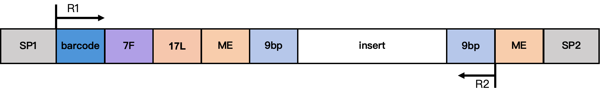
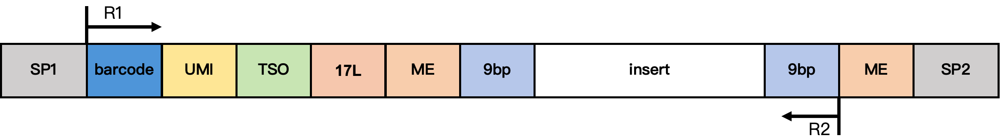

# SeekSoulMethyl
SeekSoul™ Methyl Tools（SeekSoulMethyl）是一个单细胞转录组 + 甲基化分析流程，旨在分析使用北京[寻因生物](https://www.seekgene.com/)科技有限公司 SeekOne DD 单细胞多组学甲基化 + RNA 试剂盒产生的数据。

## 版本更新


### v2.2.1（2026-09）— MCDS 合并数据丢失修复

v2.2.1 修复了甲基化 `MERGE_MCDS` 环节的一个静默数据丢失问题。在 v2.0.0–v2.2.0 中，会随机有一部分细胞在大尺度 bin 上被静默清零——**chrom1M 约 9% 的细胞、chrom500k 约 8% 的细胞**——且无任何报错或警告。默认聚类用的 `chrom20k` 不受影响。

**哪些用户需要升级**：如果您的分析使用大尺度 bin `chrom1M` / `chrom500k`，请升级到 v2.2.1 并重跑；如果只用默认的 `chrom20k` 聚类，现有结果是完整的，无需重跑。

完整报告：[merge_mcds_data_loss_fix.zh.md](docs/changelogs_detail/2.2.1/merge_mcds_data_loss_fix.zh.md) · [English](docs/changelogs_detail/2.2.1/merge_mcds_data_loss_fix.md)

## 数据结构

SeekOne DD 单细胞多组学甲基化 + RNA 试剂盒包含两种建库方案。DD-MET3（双标签）表示同一细胞的 RNA 和 DNA 甲基化数据 barcode 不同，RNA 文库为 3' 端转录组文库。DD-MET5（单标签）表示同一细胞的 RNA 和 DNA 甲基化数据 barcode 相同，RNA 文库为 5' 端转录组文库。下面分别介绍两种建库方案的 DNA 甲基化文库结构。

**DD-MET3 甲基化文库结构**
<figure style="text-align: center;">

<figcaption style="font-size: 0.95em; color: #666; margin-top: 4px;">图 1. DD-MET3 甲基化文库结构</figcaption>
</figure>

结构说明：
- SP1/SP2：接头序列
- barcode：17 bp 细胞 barcode
- 7F：7 bp 连接序列
- 17L：17 bp 固定序列 **C**gt**CC**gt**C**gttg**C**t**C**gt
- ME：19 bp 固定序列 AGATGTGTATAAGAGA**C**AG
- 9 bp：Tn5 插入片段的延伸序列

**DD-MET5 甲基化文库结构**
<figure style="text-align: center;">

<figcaption style="font-size: 0.95em; color: #666; margin-top: 4px;">图 2. DD-MET5 甲基化文库结构</figcaption>
</figure>

结构说明：
- SP1/SP2：接头序列
- barcode：17 bp 细胞 barcode
- UMI：12 bp UMI 序列
- TSO：13 bp TSO 序列 TTT**C**TTATATGGG
- 17L：17 bp 固定序列 **C**gt**CC**gt**C**gttg**C**t**C**gt
- ME：19 bp 固定序列 AGATGTGTATAAGAGA**C**AG
- 9 bp：Tn5 插入片段的延伸序列

由于酶处理会将未甲基化的胞嘧啶（C）转换为胸腺嘧啶（T），SP1 和 SP2 中的 C 碱基经过甲基化修饰，以防止在转换过程中引入测序接头错误。此外，甲基化数据所用的 barcode 不包含任何 C 碱基。相比之下，7F、17L 和 ME 中的 C 碱基未经甲基化修饰，在酶处理过程中会被转换为 T；我们利用这些固定序列来计算 C-to-T 转换率。

## 安装


1. 克隆仓库：
```bash
git clone https://github.com/seekgene/SeekSoulMethyl.git
cd SeekSoulMethyl
```

2. 创建并激活 conda 环境：

中国用户：
```bash
conda env create -n seeksoulmethyl -f conda_dependencies.zh.yml
conda activate seeksoulmethyl
```

国际用户：
```bash
conda env create -n seeksoulmethyl -f conda_dependencies.yml
conda activate seeksoulmethyl
```

3. 安装软件包：
```bash
cd dependence
pip install . \
  simpleqc/target/wheels/simpleqc-0.1.0-py3-none-manylinux_2_17_x86_64.manylinux2014_x86_64.whl \
  search-pattern/target/wheels/search_pattern-0.1.0-py3-none-manylinux_2_5_x86_64.manylinux1_x86_64.whl
cd ..

```
我们将下载经过修改的 Bismark 和 ALLCools 版本用于分析。

- [Bismark](https://github.com/seekgene/Bismark.git) 在 BAM 文件中添加了 CB（纠错后 barcode）标签和 UR（原始 UMI）标签。
- [ALLCools](https://github.com/seekgene/ALLCools.git) 基于 UR 标签进行 UMI 去重和甲基化水平计算。

```shell
# 克隆并安装自定义 ALLCools
conda activate seeksoulmethyl
git clone https://github.com/seekgene/ALLCools.git && \
pip install ./ALLCools && \
rm -rf ./ALLCools

# 克隆并安装自定义 Bismark
git clone https://github.com/seekgene/Bismark.git && \
bin_path=$(dirname `which python`)
cp -r ./Bismark/* $bin_path/ && \
    chmod +x $bin_path/bismark* && \
    chmod +x $bin_path/deduplicate_bismark && \
    rm -rf ./Bismark

```

## 下载参考数据库

```bash
# 下载人类参考基因组（GRCh38）
wget -c -O human-reference-GRCh38.tar.gz "https://seekgene-public.oss-cn-beijing.aliyuncs.com/methy_demo/methy_exp/v1.1/human-reference-GRCh38.tar.gz"
wget -c -O human-reference-GRCh38.tar.gz.md5 "https://seekgene-public.oss-cn-beijing.aliyuncs.com/methy_demo/methy_exp/v1.1/human-reference-GRCh38.tar.gz.md5"

# 下载小鼠参考基因组（GRCm39）
wget -c -O mouse-reference-GRCm39.tar.gz "https://seekgene-public.oss-cn-beijing.aliyuncs.com/methy_demo/methy_exp/v1.1/mouse-reference-GRCm39.tar.gz"
wget -c -O mouse-reference-GRCm39.tar.gz.md5 "https://seekgene-public.oss-cn-beijing.aliyuncs.com/methy_demo/methy_exp/v1.1/mouse-reference-GRCm39.tar.gz.md5"

# 解压参考基因组
tar -xzf human-reference-GRCh38.tar.gz
tar -xzf mouse-reference-GRCm39.tar.gz
```

## 下载测试数据（可选）

如需使用小数据集测试流程，可下载以下测试数据：

```bash
# 下载转录组测试数据
wget -c -O XYRD-WTJW880-E_S1_L005_R1_001.fastq.gz "https://seekgene-public.oss-cn-beijing.aliyuncs.com/methy_demo/methy_exp/fastq/XYRD-WTJW880-E_S1_L005_R1_001.fastq.gz"
wget -c -O XYRD-WTJW880-E_S1_L005_R1_001.fastq.gz.md5 "https://seekgene-public.oss-cn-beijing.aliyuncs.com/methy_demo/methy_exp/fastq/XYRD-WTJW880-E_S1_L005_R1_001.fastq.gz.md5"
wget -c -O XYRD-WTJW880-E_S1_L005_R2_001.fastq.gz "https://seekgene-public.oss-cn-beijing.aliyuncs.com/methy_demo/methy_exp/fastq/XYRD-WTJW880-E_S1_L005_R2_001.fastq.gz"
wget -c -O XYRD-WTJW880-E_S1_L005_R2_001.fastq.gz.md5 "https://seekgene-public.oss-cn-beijing.aliyuncs.com/methy_demo/methy_exp/fastq/XYRD-WTJW880-E_S1_L005_R2_001.fastq.gz.md5"

# 下载甲基化测试数据
wget -c -O XYRD-WTJW880-MET_S01_L001_R1_001.fastq.gz "https://seekgene-public.oss-cn-beijing.aliyuncs.com/methy_demo/methy_exp/tiny_fastq/XYRD-WTJW880-MET_S01_L001_R1_001.fastq.gz"
wget -c -O XYRD-WTJW880-MET_S01_L001_R1_001.fastq.gz.md5 "https://seekgene-public.oss-cn-beijing.aliyuncs.com/methy_demo/methy_exp/tiny_fastq/XYRD-WTJW880-MET_S01_L001_R1_001.fastq.gz.md5"
wget -c -O XYRD-WTJW880-MET_S01_L001_R2_001.fastq.gz "https://seekgene-public.oss-cn-beijing.aliyuncs.com/methy_demo/methy_exp/tiny_fastq/XYRD-WTJW880-MET_S01_L001_R2_001.fastq.gz"
wget -c -O XYRD-WTJW880-MET_S01_L001_R2_001.fastq.gz.md5 "https://seekgene-public.oss-cn-beijing.aliyuncs.com/methy_demo/methy_exp/tiny_fastq/XYRD-WTJW880-MET_S01_L001_R2_001.fastq.gz.md5"


```

**注意**：这是用于流程验证的小型测试数据集。正式分析请使用您自己的测序数据。

## 仓库结构


克隆后，关键的 Nextflow 入口文件和模块如下：

- `nf/main.nf`：顶层入口。通过 `--workflow` 选择子工作流（`rna_met`、`methy_only`、`force_cell`）。
- `nf/subworkflows/`：工作流定义：
  - `rna_met/main.nf`：转录组 + 甲基化端到端处理。
  - `met_only/main.nf`：仅甲基化工作流。
  - `forcecell/main.nf`：Force-cell 工作流（使用先前输出重新计算/更新结果）。
- `nf/modules/`：分步处理模块：
  - `step1.nf` 预处理、质控、barcode 提取、转录组分析。
  - `step2.nf` Bismark 比对和 BAM 排序。
  - `step3.nf` 按细胞拆分 BAM、ALLC 生成/合并、多尺度数据集。
  - `step4.nf` 汇总统计、降维、联合报告。
  - `utils.nf` 仅甲基化工作流的辅助工具（reads 计数和细胞估算）。
- `nf/bin/`：辅助脚本和资源文件（如 barcode 白名单）。
- `nf/nextflow.config`：执行器和资源配置。
- `nf/nextflow_schema.json`：流程参数 schema。
- `sc_methy_workflow.sh`：运行双组学分析流程的 Shell 脚本。

我们提供两种数据分析方法：

1. **Shell 脚本**：通过 `sc_methy_workflow.sh` 脚本直接运行分析流程。
2. **Nextflow 流程**：通过 `nf/main.nf` 运行 Nextflow 流程。

两种方法的详细说明如下。

## 文档


教程和参考资料位于 [docs/](docs) 目录下：

- [如何构建参考基因组数据库（`--database_dir`）](docs/How_to_build_reference_genome.md)
- [如何获取单细胞 BAM 文件](docs/Obtain_single_cell_bam.md)（[中文](docs/Obtain_single_cell_bam.zh.md)）
- [如何对单细胞 BAM 文件进行去重](docs/How_to_deduplicate_single_cell_bam.md)（[中文](docs/How_to_deduplicate_single_cell_bam.zh.md)）
- [使用方法 —— 双组学（Shell）与 Nextflow](docs/usage.zh.md)（[English](docs/usage.md)）
- [算法与流程原理](docs/algorithm.zh.md)（[English](docs/algorithm.md)）
- [输出文件](docs/outputs.zh.md)（[English](docs/outputs.md)）
- [常见问题](docs/faq.zh.md)（[English](docs/faq.md)）
- [版本更新详情 —— v2.2.1 MCDS 合并数据丢失修复](docs/changelogs_detail/2.2.1/merge_mcds_data_loss_fix.zh.md)（[English](docs/changelogs_detail/2.2.1/merge_mcds_data_loss_fix.md)）

## 许可证


本项目采用 MIT 许可证 - 详见 LICENSE 文件。

## 参考文献


[1] Lu X, Yuan Y, et al. Improved tagmentation-based whole-genome bisulfite sequencing for input DNA from less than 100 mammalian cells. Epigenomics. 2015;7(1):47-56. doi:10.2217/epi.14.76.
> "Furthermore, by manually checking the reads, we found a part of the reads were completely unconverted. We suspected that a nick in the synthesized adapters will cause the whole fragment displaced with incorporation of 5-methyl-dCTPs due to nick translation activity of Bst polymerase."
