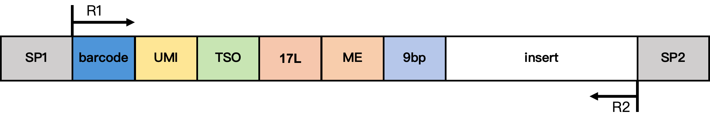
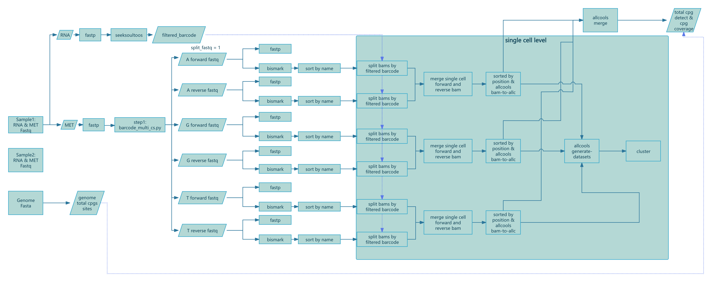

# SeekSoulMethyl 使用说明（中文）

SeekSoulMethyl 是针对北京希克基因生物科技有限公司单细胞转录组 + 甲基化双组学试剂的分析流程，用于对单细胞 RNA 与 DNA 甲基化数据进行联合处理与分析。

## 数据结构
RNA-MET 数据包含两种化学类型：
- DD-MET3（双标签）：同一细胞的 RNA 与 DNA 甲基化数据的条码不同，RNA 转录组属于 3′ 转录组数据。
- DD-MET5（单标签）：同一细胞的 RNA 与 DNA 甲基化数据的条码相同，RNA 转录组属于 5′ 转录组数据。

下图展示两种化学类型的甲基化文库结构示意图。

**DD-MET3 甲基化文库结构**
<figure style="text-align: center;">

<figcaption style="font-size: 0.95em; color: #666; margin-top: 4px;">图 1. DD-MET3 甲基化文库结构</figcaption>
</figure>

结构说明：
- SP1/SP2：接头序列
- barcode：17 bp 细胞条码
- 7F：7 bp 连接序列
- 17L 和 ME：17 bp 固定序列 <span style="color:#43a047;">Y</span>gt<span style="color:#43a047;">Y</span><span style="color:#43a047;">Y</span>gt<span style="color:#43a047;">Y</span>gttg<span style="color:#43a047;">Y</span>t<span style="color:#43a047;">Y</span>gt
- ME：19 bp 固定序列 AGATGTGTATAAGAGA<span style="color:#43a047;">Y</span>AG
- 9 bp：来自 Tn5 插入片段的延伸序列

**DD-MET5 甲基化文库结构**
<figure style="text-align: center;">

<figcaption style="font-size: 0.95em; color: #666; margin-top: 4px;">图 2. DD-MET5 甲基化文库结构</figcaption>
</figure>

结构说明：
- SP1/SP2：接头序列
- barcode：17 bp 细胞条码
- UMI：12 bp UMI 序列
- TSO：13 bp TSO 序列 TTT<span style="color:#43a047;">Y</span>TTATATGGG
- 17L 和 ME：17 bp 固定序列 <span style="color:#43a047;">Y</span>gt<span style="color:#43a047;">Y</span><span style="color:#43a047;">Y</span>gt<span style="color:#43a047;">Y</span>gttg<span style="color:#43a047;">Y</span>t<span style="color:#43a047;">Y</span>gt
- ME：19 bp 固定序列 AGATGTGTATAAGAGA<span style="color:#43a047;">Y</span>AG
- 9 bp：来自 Tn5 插入片段的延伸序列

## 安装与准备
1. 克隆仓库并进入项目目录。
2. 使用提供的 YAML 文件创建并激活 Conda 环境（国际用户使用 `conda_dependencies.yml`；国内用户使用 `conda_dependencies.zh.yml`）。
3. 在 `dependence` 目录安装 Python 依赖（包括 SimpleQC 和 Search Pattern wheel）。
4. 安装 SeekGene 发布的定制版 Bismark 与 ALLCools。Bismark 会为 BAM 文件添加 CB（纠错条码）与 UR（原始 UMI）标签；ALLCools 基于 UR 标签进行 UMI 去重与甲基化定量。

### 克隆仓库
```bash
git clone https://github.com/seekgene/SeekSoulMethyl.git
cd SeekSoulMethyl
```

### 创建并激活 Conda 环境

国内用户：
```bash
conda env create -n seeksoulmethyl -f conda_dependencies.zh.yml
conda activate seeksoulmethyl
```

国际用户：
```bash
conda env create -n seeksoulmethyl -f conda_dependencies.yml
conda activate seeksoulmethyl
```

### 安装依赖
```bash
cd dependence
pip install . \
  simpleqc/target/wheels/simpleqc-0.1.0-py3-none-manylinux_2_17_x86_64.manylinux2014_x86_64.whl \
  search-pattern/target/wheels/search_pattern-0.1.0-py3-none-manylinux_2_5_x86_64.manylinux1_x86_64.whl
cd ..
```

### 安装定制版 ALLCools 与 Bismark
```shell
# 安装 ALLCools（定制版）
conda activate seeksoulmethyl
git clone https://github.com/seekgene/ALLCools.git && \
pip install ./ALLCools && \
rm -rf ./ALLCools

# 安装 Bismark（定制版）
git clone https://github.com/seekgene/Bismark.git && \
bin_path=$(dirname `which python`)
cp -r ./Bismark/* $bin_path/ && \
    chmod +x $bin_path/bismark* && \
    chmod +x $bin_path/deduplicate_bismark && \
    rm -rf ./Bismark
```

## 参考数据库
从 SeekGene 公共存储下载人（GRCh38）或鼠（GRCm39）参考数据包并解压，记录解压路径用于 `--database_dir` 参数。

```bash
# 下载人参考基因组（GRCh38）
wget -dc -O human-reference-GRCh38.tar.gz "https://seekgene-public.oss-cn-beijing.aliyuncs.com/methy_demo/methy_exp/v1.1/human-reference-GRCh38.tar.gz"
wget -dc -O human-reference-GRCh38.tar.gz.md5 "https://seekgene-public.oss-cn-beijing.aliyuncs.com/methy_demo/methy_exp/v1.1/human-reference-GRCh38.tar.gz.md5"

# 下载鼠参考基因组（GRCm39）
wget -dc -O mouse-reference-GRCm39.tar.gz "https://seekgene-public.oss-cn-beijing.aliyuncs.com/methy_demo/methy_exp/v1.1/mouse-reference-GRCm39.tar.gz"
wget -dc -O mouse-reference-GRCm39.tar.gz.md5 "https://seekgene-public.oss-cn-beijing.aliyuncs.com/methy_demo/methy_exp/v1.1/mouse-reference-GRCm39.tar.gz.md5"

# 解压参考基因组
tar -xzf human-reference-GRCh38.tar.gz
tar -xzf mouse-reference-GRCm39.tar.gz
```

## 测试数据（可选）
为快速验证流程，可从 SeekGene 公共存储下载小型演示 FASTQ（RNA 与甲基化），仅用于功能测试；正式分析请使用自己的测序数据。

```bash
# 下载转录组测试数据
wget -dc -O XYRD-WTJW880-E_S1_L005_R1_001.fastq.gz "https://seekgene-public.oss-cn-beijing.aliyuncs.com/methy_demo/methy_exp/fastq/XYRD-WTJW880-E_S1_L005_R1_001.fastq.gz"
wget -dc -O XYRD-WTJW880-E_S1_L005_R1_001.fastq.gz.md5 "https://seekgene-public.oss-cn-beijing.aliyuncs.com/methy_demo/methy_exp/fastq/XYRD-WTJW880-E_S1_L005_R1_001.fastq.gz.md5"
wget -dc -O XYRD-WTJW880-E_S1_L005_R2_001.fastq.gz "https://seekgene-public.oss-cn-beijing.aliyuncs.com/methy_demo/methy_exp/fastq/XYRD-WTJW880-E_S1_L005_R2_001.fastq.gz"
wget -dc -O XYRD-WTJW880-E_S1_L005_R2_001.fastq.gz.md5 "https://seekgene-public.oss-cn-beijing.aliyuncs.com/methy_demo/methy_exp/fastq/XYRD-WTJW880-E_S1_L005_R2_001.fastq.gz.md5"

# 下载甲基化测试数据
wget -dc -O XYRD-WTJW880-MET_S01_L001_R1_001.fastq.gz "https://seekgene-public.oss-cn-beijing.aliyuncs.com/methy_demo/methy_exp/tiny_fastq/XYRD-WTJW880-MET_S01_L001_R1_001.fastq.gz"
wget -dc -O XYRD-WTJW880-MET_S01_L001_R1_001.fastq.gz.md5 "https://seekgene-public.oss-cn-beijing.aliyuncs.com/methy_demo/methy_exp/tiny_fastq/XYRD-WTJW880-MET_S01_L001_R1_001.fastq.gz.md5"
wget -dc -O XYRD-WTJW880-MET_S01_L001_R2_001.fastq.gz "https://seekgene-public.oss-cn-beijing.aliyuncs.com/methy_demo/methy_exp/tiny_fastq/XYRD-WTJW880-MET_S01_L001_R2_001.fastq.gz"
wget -dc -O XYRD-WTJW880-MET_S01_L001_R2_001.fastq.gz.md5 "https://seekgene-public.oss-cn-beijing.aliyuncs.com/methy_demo/methy_exp/tiny_fastq/XYRD-WTJW880-MET_S01_L001_R2_001.fastq.gz.md5"
```

## 仓库结构
- `nf/main.nf`：RNA + 甲基化端到端主流程
- `nf/methy_only.nf`：仅甲基化数据流程
- `nf/modules/`：各步骤模块（预处理、比对、拆分、ALLC 生成与合并、数据集构建、汇总与报告）
- `nf/bin/`：辅助脚本与资源（如条码白名单）
- `nf/nextflow.config`：执行器与资源配置

## 使用方法（Shell 工作流）
在已激活的环境中，使用项目根目录的脚本运行联合分析。需要提供四个 FASTQ（RNA R1/R2 与甲基化 R1/R2）、样本名、输出目录、参考数据库路径、化学类型（DD-MET3 或 DD-MET5）、CPU 核数以及可选的 CH 过滤阈值。

```bash
# 项目根目录下的工作流脚本示例
bash sc_methy_workflow.sh \
/path/to/expression_R1.fastq.gz \
/path/to/expression_R2.fastq.gz \
/path/to/methy_R1.fastq.gz \
/path/to/methy_R2.fastq.gz \
--sample WTJW880 \
--outdir /path/to/results \
--database_dir /path/to/human-reference-GRCh38 \
--chemistry DD-MET3 \
--core 64 \
--filter_ch 2
```

### 输入参数说明
- `expression_r1`：单细胞转录组 Read1 FASTQ
- `expression_r2`：单细胞转录组 Read2 FASTQ
- `methylation_r1`：单细胞甲基化 Read1 FASTQ
- `methylation_r2`：单细胞甲基化 Read2 FASTQ
- `sample`：样本名称
- `outdir`：输出目录路径
- `database_dir`：参考数据库路径
- `chemistry`：化学类型（`DD-MET3` 或 `DD-MET5`）
- `core`：CPU 核心数
- `filter_ch`：过滤含非 CpG 甲基化 C 数量超过阈值的 reads（默认 >2）

## 处理流程细节
### RNA 处理流程
RNA 数据使用 SeekSoulTools 进行分析，细胞集合基于 RNA 文库识别的条码。

### 甲基化处理流程
#### 步骤 1：预处理与条码解析
**条码提取与纠正**：依据结构定位并提取条码，若条码在白名单内视为有效，否则视为无效。启用纠正后，若无效条码与白名单中某条码仅有 1 个碱基差（Hamming 距离 = 1），则：唯一候选时纠正为该条码；多候选时纠正为支持读数最多的条码。

**UMI 提取**：按结构定位并提取 UMI，不进行纠正。

**正反链判定**：根据 17L 与 ME 的位置使用 7 个 C/T 位点，其中最后两个位点用于判定：两者均为 C 记为反链，否则为正链。反链对应 CTOT/CTOB，正链对应 OT/OB。

**C–T 转化率**：除判定用的 2 个位点外，使用剩余 5 个 C/T 位点计算 C–T 转化率：
<div style="font-size: 0.8em;">

$$
    CT\ 转化率 = \frac{\text{Forward reads 中五个位点上的 "T" 总数}}{\text{Forward reads 数} \times 5}
$$

</div>

**读取过滤（可选）**：按非 CpG 甲基化 C 的数量过滤读对，默认过滤 >2 的读对。

#### 步骤 2：Bismark 比对与按名称排序
使用定制版 Bismark 进行比对，并写入 CB/UR 标签。正链使用 `-X 1000`（最大插入片段 1000 bp），反链使用 `--pbat` 与 `-X 1000`。比对后使用 `samtools sort -n` 按名称排序，作为后续输入。

#### 步骤 3：ALLCools 分析
**按细胞条码拆分**：根据 RNA 识别的细胞条码，将名称排序后的 BAM 拆分为每细胞文件。
**生成 ALLC 文件**：将每细胞 BAM 按位置排序，并使用 ALLCools `bam-to-allc` 转换。定制版 ALLCools 基于 UR 标签进行 UMI 校正与去重。
**生成 MCDS**：使用 `allcools generate-dataset` 对基因组分箱并生成每细胞甲基化矩阵。

#### 步骤 4：降维与聚类
默认基于 chrom20k 分箱进行 LSI 降维，并使用 UMAP 可视化。

### 系统环境要求
如果使用 `sc_methy_workflow.sh`，系统环境要求如下：
- CPU：建议 64 核
- 内存：建议 128 GB RAM
- 存储：建议剩余空间 ≥ 500 GB
- 操作系统：Linux（建议 Ubuntu 18.04+ 或 CentOS 7+）

## 使用 Nextflow（推荐）
若希望批量处理样本并生成流程级报告，建议使用 Nextflow。准备包含列 `sample_id, expression_r1, expression_r2, methylation_r1, methylation_r2` 的 CSV，选择合适的执行器与配置文件运行 `nf/main.nf`。

```bash
conda activate seeksoulmethyl
conda install -n seeksoulmethyl -c bioconda nextflow

# 运行主流程（示例）
nextflow run SeekSoulMethyl/nf/main.nf \
  --outdir /path/to/results \
  --samplesheet samplelist.csv \
  -w /path/to/work \
  -c SeekSoulMethyl/nf/nextflow.config \
  -profile aliyun_k8s \
  --database_dir /path/to/reference \
  --split_fastq 4 \
  --filter_ch 2 \
  --chemistry DD-MET3 > methy.log
```
<figure style="text-align: center;">

<figcaption style="font-size: 0.95em; color: #666; margin-top: 4px;">Figure 3. SeekSoulMethyl nextflow pipeline 流程图</figcaption>
</figure>

## 使用 Nextflow

1. 安装 Nextflow 到同一环境。
```bash
conda install -n seeksoulmethyl -c bioconda nextflow
```

2. 准备包含绝对路径的 `samplelist.csv`：
```
cat > samplelist.csv << EOF
sample_id,expression_r1,expression_r2,methylation_r1,methylation_r2
XYRD-WTJW880,/path/to/XYRD-WTJW880-E_S1_L005_R1_001.fastq.gz,/path/to/XYRD-WTJW880-E_S1_L005_R2_001.fastq.gz,/path/to/XYRD-WTJW880-MET_S01_L001_R1_001.fastq.gz,/path/to/XYRD-WTJW880-MET_S01_L001_R2_001.fastq.gz
EOF
```

3. 运行流程：
```bash
nextflow run -bg SeekSoulMethyl/nf/main.nf \
--outdir /path/to/tiny_demo/results/ \
--samplesheet samplelist.csv \
-w /path/to/tiny_demo/results/work \
-c SeekSoulMethyl/nf/nextflow.config \
-profile aliyun_k8s \
--database_dir /path/to/human-reference-GRCh38/ \
--split_fastq 1 \
--filter_ch 2 \
--chemistry DD-MET3 > methy.log
```

### nextflow.config 示例
```groovy
profiles {
  // Local machine
  local {
    process.executor = 'local'
    workDir          = '/path/to/work'
    process.cpus     = 8
    process.memory   = '32 GB'
    conda.enabled    = true
    // Or containers: singularity.enabled = true / docker.enabled = true
  }

  // Slurm cluster (HPC)
  slurm {
    process.executor   = 'slurm'
    workDir            = '/lustre/work/your_user'
    process.cpus       = 8
    process.memory     = '32 GB'
    process.queue      = 'normal'
    process.clusterOptions = '-A your_account --qos=normal'

    withLabel: 'high_mem' {
      cpus   = 16
      memory = '64 GB'
    }
  }

  // Kubernetes (e.g., Alibaba Cloud ACK)
  aliyun_k8s {
    process.executor   = 'k8s'
    workDir            = '/mnt/nf-work'    // persistent volume path
    k8s {
      namespace        = 'your-namespace'
      storageClaimName = 'your-pvc'
      cpu              = 4
      memory           = '16 GB'
    }
    // If using container images globally: docker.enabled = true
  }
}
```

### nextflow.config 提示
`nextflow.config` 用于声明执行环境、资源配额与运行策略。请根据自身服务器或集群定制：选择合适的执行器（如 `local`、`slurm`、`k8s` 等）、设置 CPU/内存/时间资源、准备可写且容量充足的工作目录，并根据环境选择启用 `conda` 或容器。

## 仅甲基化流程（测试版，不推荐生产使用）
当只有甲基化数据时，可运行 `nf/methy_only.nf`，其基本参数与主流程一致。

## 输出结构（按 outdir 布局）
- `fastp/`：原始与条码解析后 FASTQ 的 QC 报告（html/json）
- `${sample}/${sample}_exp/`：RNA 分析结果（过滤矩阵、聚类、差异表达等）
- `${sample}/${sample}_methy/step1/`：条码解析与分片后的 FASTQ
- `${sample}/${sample}_methy/step2/`：Bismark BAM 与报告
- `${sample}/${sample}_methy/step3/`：
  - `split_bams/` 与 `split_bams/merged/`：每细胞 BAM、合并 BAM、条码计数
  - `allcools/` 与 `allcools_generate_datasets/`：每细胞 ALLC 与 `${sample}.mcds`
  - `${sample}_merge_allc.gz`、`*.CGN-Merge*`
- `${sample}/${sample}_methy/step4/`：聚类图与 `*.h5ad`
- `${sample}/`：
  - `${sample}_methy_summary.json`、`${sample}_wgs_summary.csv`
  - `${sample}_rna_methyl_report.html`（主流程）

## FAQ
- `samplesheet` 解析错误：确保第一列为 `sample_id`，使用绝对路径。
- 缺少 `${sample}.mcds`：检查 `ALLCOOLS_BAM_TO_ALLC` 是否生成每细胞 `*_allc.gz`，以及 `chrom_size_path` 是否正确。
- Bismark 阶段卡住：确认参考索引是否正确，以及 `params.bismark_ref` 在容器内可见。
- 断点续跑：使用 `-resume` 并保持相同 `-w` 工作目录。

## 许可证
本项目遵循 MIT License，详情见仓库中的 LICENSE 文件。
