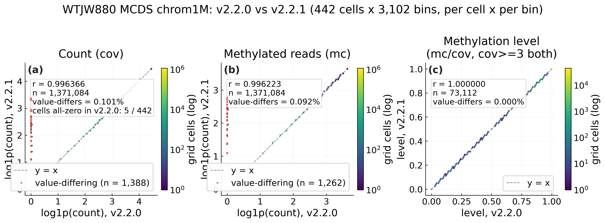
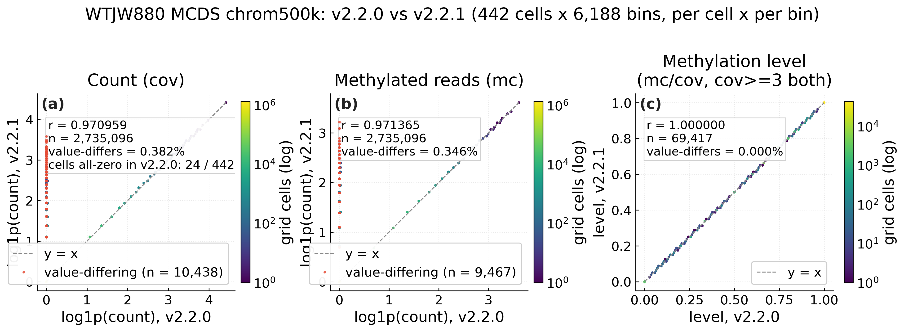
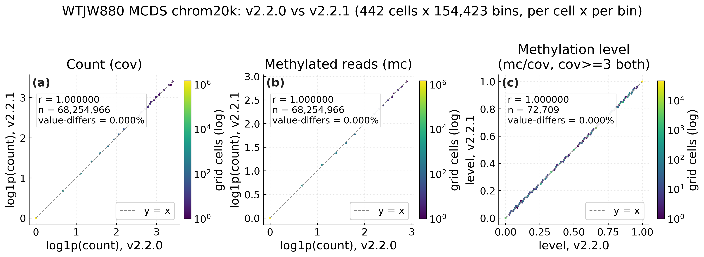
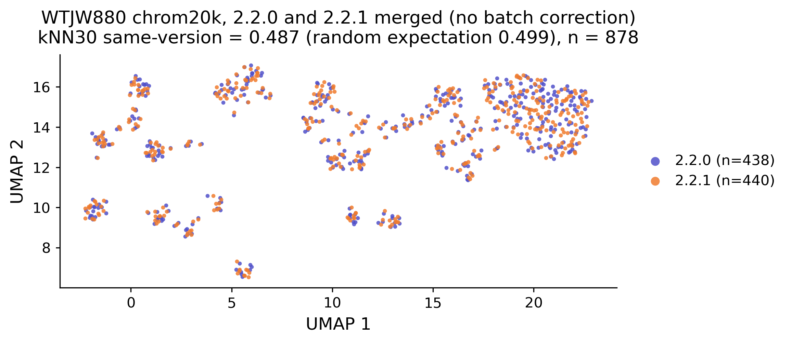

# SeekSoulMethyl v2.2.1 升级报告

**报告对象**：SeekSoulMethyl 流程的使用者
**升级内容**：修复甲基化 MCDS 合并环节（`MERGE_MCDS`）的静默数据丢失问题
**受影响版本**：v2.0.0 – v2.2.0
**修复版本**：v2.2.1
**日期**：2026 年 9 月

---

## 一、摘要

SeekSoulMethyl v2.2.1 是一次**缺陷修复版本**（无新功能、无接口变化），修复了甲基化 `MERGE_MCDS` 环节的一个**静默数据丢失问题**。该环节负责将分片单细胞甲基化矩阵合并成最终用于聚类和下游分析的 MCDS。

> **MCDS 是什么？** MCDS（甲基化细胞数据容器）是存放每个细胞在各基因组区间的甲基化信息的标准格式。**bin** 是把基因组切成固定长度的小格子——`chrom20k` 表示每格 2 万碱基（默认用于聚类），`chrom1M` 表示每格 100 万碱基、`chrom500k` 表示每格 50 万碱基（更粗的大格子）。

此问题会导致**随机的一部分细胞在大尺度 bin 上被静默清零**——**chrom1M 约 9% 的细胞、chrom500k 约 8% 的细胞**被整行清零，且**无任何报错、无任何警告、无明显异常**。而**默认聚类用的 chrom20k 基本不受影响**（33 个样本中仅极个别样本有个别 bin 的微小缺失，不影响聚类结论）。

本报告还包含一节**修复前后一致性验证**（第七章）：同一份样本在 v2.2.0（修复前）与 v2.2.1（修复后）跑出的结果，**chrom20k 矩阵基本一致**（仅个别 bin 微小差异）、聚类完全混合——证明该修复不改变默认聚类结果。

**一句话结论**：如果只用默认的 `chrom20k` 聚类，现有结果是完整的，**无需重跑**；如果使用 `chrom1M` / `chrom500k` 大尺度 bin，请升级到 v2.2.1 并重跑。

---

## 二、问题背景

`MERGE_MCDS` 环节将上游 `allcools generate-dataset` 产生的分片 MCDS 合并成一个完整 MCDS。合并结果通过 xarray 的 `to_zarr(append_dim=...)` 以 Dask 并行的方式写入 Zarr 存储。

在 v2.0.0 至 v2.2.0 版本中，该 append 操作**没有先做数据物化**（`ds.load()`）。在旧版 xarray 的 chunk 对齐检查下，append 路径没有强制校验「正在写入的 Dask chunk」与「Zarr 存储中已有 chunk」的对齐关系。当多个 Dask chunk 映射到同一个 Zarr chunk 并被并发写入时，就会产生**竞态**（多个任务同时写同一个格子、互相覆盖），可能静默地把某个细胞的整行数据覆盖成零。

由于该失败是静默且随机的，受影响的细胞在矩阵中零散分布，只能通过与独立真值比对才能发现。

---

## 三、根因

- **上游 issue**：[xarray #8876 —— 「向已存在的 Zarr 存储追加时可能发生竞态」](https://github.com/pydata/xarray/issues/8876)（相关 issue：[#8882 —— 「to_zarr 在使用 append_dim 时静默丢失数据」](https://github.com/pydata/xarray/issues/8882)）。
- **机制**：`to_zarr(append_dim=...)` 在 Dask 并行写入、chunk 不对齐时，可能把多个 Dask chunk 并发写入同一个 Zarr chunk，导致数据丢失。
- **为何静默**：xarray 的 chunk 对齐安全检查（`safe_chunks`）只在「新建变量」时生效，append 路径绕过了本应报错的检查。

---

## 四、v2.2.1 修复了什么

v2.2.1 在 append 之前显式加入 `ds.load()`，使合并数据**完整物化后串行写入**，从而消除并发写入的竞态。

- 受影响版本：**v2.0.0 – v2.2.0**
- 修复版本：**v2.2.1**（修复已推送到发布分支并打 tag）

> **内存代价说明**：`ds.load()` 会把合并后的整个 MCDS 先完整载入内存再写入。大样本下会提高内存峰值——这是「以内存换正确性」的取舍（串行写入、无竞态）。

---

## 五、影响范围

该问题只影响**大尺度 bin**（这些 bin 的 `count_type` 维度以「整块」方式 chunk，mc 与 cov 打包进同一个 chunk）。

> **mc 和 cov 是什么？** 对每个细胞、每个 bin：`cov`（覆盖度）是覆盖该 bin 的总 reads 数，`mc`（甲基化 reads 数）是其中支持甲基化的 reads 数。甲基化水平就是 `mc/cov`。

共发现三种损伤形态：

| 损伤形态 | 表现 | 影响 bin |
|---|---|---|
| **整行清零** | 细胞的 mc 与 cov 同时归零 | chrom1M（约 9%）、chrom500k（约 8%） |
| **mc 减半** | cov 不变、mc 减半 | 小尺度 bin（偶发，个别细胞） |
| **cov 减半** | mc 不变、cov 减半 | 小尺度 bin（偶发，个别细胞） |

| bin | v2.2.0 丢失 | v2.2.1 |
|---|---|---|
| chrom1M | 约 9% 细胞清零 | **0（全部找回）** |
| chrom500k | 约 8% 细胞清零 | **0（全部找回）** |
| chrom100k / 50k / 10k | 基本无损（偶发单个细胞减半） | 0 |
| geneslop2k | 仅偶发 cov 减半（mc 无损，个别细胞） | 0 |
| **chrom20k（默认聚类）** | **基本无缺失** | **基本无缺失** |

> 「减半」两种形态属**经验观察**；竞态机制本身只能解释「整行清零」，「减半」大概率是并发写入的部分覆盖变体。报告最关键的一条安抚性结论——**chrom20k 几乎不丢失**——是第六章四条独立证据链（其中 6.1–6.3 专证 chrom20k 基本无丢失，6.4 证 chrom1M/500k 全量找回）的一致实证结果，其免疫的确切机理尚未完全解释，但所有证据一致。

> `geneslop2k`（基因上下游 2 kb 的 bin，用于基因水平 DMG——差异甲基化基因分析）只受 **cov 减半** 影响——mc 无损，仅个别细胞丢失 cov。这不改变 chrom20k 聚类的结论。

---

## 六、验证与测试结果

通过四条独立证据链对修复进行了验证（四条都指向同一结论：chrom20k 基本无丢失、chrom1M/500k 的丢失已全部找回）：

### 6.1 33 个生产样本的跨 bin 一致性审计

对 **33 个生产甲基化样本**（共 295,408 个细胞、7 个批次）做跨 bin 一致性审计：比较每个细胞在六个 bin 分辨率下的覆盖度总和，某 bin 总量为 0 而其他正常，即代表该细胞在该 bin 丢失。

| bin | 平均丢失率 |
|---|---|
| chrom1M | 9.4%（单样本 7.2% – 13.4%） |
| chrom500k | 8.3%（单样本 6.4% – 10.5%） |
| **chrom20k** | **基本无丢失（个别 bin 微小缺失）** |
| chrom100k / 50k / 10k | 0 |

> 这里的 9.4% 是「各单样本丢失率的简单平均」；按绝对细胞数口径（6.4 节找回 28,726 个）对应全部细胞的 9.7%。两者都只指 chrom1M、描述同一现象。

### 6.2 v2.2.0 复现

用 v2.2.0（即含该问题的版本）重跑 14 个 MCDS，复现出同等量级的丢失——chrom1M 约 9.6%、chrom500k 约 8.8%、chrom20k 基本为 0——证明重跑链路正确、问题稳定可复现。

### 6.3 从单细胞 ALLC 文件重建真值

将一个样本的 MCDS 直接从单细胞 ALLC（全胞嘧啶位点甲基化文件）文件重建（跳过合并步骤，即真值），与旧 MCDS 逐细胞、逐 bin 比对：

| bin | 被清零的细胞数 |
|---|---:|
| chrom1M | 687 |
| chrom500k | 601 |
| **chrom20k** | **0** |

### 6.4 v2.2.1 修复验证（逐细胞、逐 bin）

v2.2.1（含 `ds.load()` 修复）完整跑完后，与 v2.2.0 在全部 33 个样本上逐细胞、逐 bin 对比：

| bin | v2.2.1 找回的细胞数 |
|---|---:|
| chrom1M | **28,726** |
| chrom500k | **26,442** |
| chrom20k | 基本为 0（仅个别细胞存在单 bin 的 mc/cov 微小差异） |

**结论**：v2.2.0 在 chrom1M/500k 上静默清零的每一个细胞，都在 v2.2.1 中完整恢复；chrom20k 基本不受影响（仅个别细胞存在单 bin 的微小差异，无整行清零）。

### 6.5 修复前后逐 bin 对比

下图逐细胞、逐 bin 对比了 v2.2.0（修复前）与 v2.2.1（修复后）在 chrom1M 和 chrom500k 上的结果。**如何读图**：横轴是 v2.2.0 的数值、纵轴是 v2.2.1 的数值；落在对角线上的点表示两版完全一致。红色点标出的 cell×bin 格子即两版数值不同的位置——**它们全部是 v2.2.0 被整行清零（横轴为 0）、v2.2.1 完整找回（纵轴有值）**（差异严格单向：不存在 v2.2.0 有值而 v2.2.1 为零的反向丢失）。这直观展示了修复成功：v2.2.1 找回了 v2.2.0 在这两个大尺度 bin 上静默丢失的数据。

 图 1 — chrom1M：v2.2.0 vs v2.2.1。红点 = v2.2.0 被清零、v2.2.1 找回的细胞。

 图 2 — chrom500k：v2.2.0 vs v2.2.1。红点 = v2.2.0 被清零、v2.2.1 找回的细胞。

作为对比，**chrom20k**（默认聚类 bin）如下所示：它在 WTJW880 样本上两版一致（r = 1.0），与该缺陷基本不影响 chrom20k 的事实一致。

 图 3 — chrom20k：v2.2.0 vs v2.2.1，WTJW880 样本上一致（r = 1.0）。

### 6.6 质控结果在修复前后完全一致

同一份样本（WTJW880）在 v2.2.0 与 v2.2.1 下的质控 summary 显示：**每一项质控指标都完全相同**（这 10 项均为合并环节**上游**的质控指标，修复发生在合并环节、不触及这些指标，故完全一致；合并后 chrom1M/500k 的数据变化见 6.4/6.5 节）。

| 指标 | v2.2.0 | v2.2.1 |
|---|---|---|
| 检出细胞数 | 442 | 442 |
| 转录组每细胞基因中位数 | 1,066 | 1,066 |
| 甲基化中位细胞 CpG 数 | 905 | 905 |
| 转录组有效 barcode | 91.21% | 91.21% |
| 转录组测序饱和度 | 83.22% | 83.22% |
| 甲基化有效 barcode | 85.84% | 85.84% |
| C-T 转化率 | 99.80% | 99.80% |
| CpG 甲基化率 | 80.74% | 80.74% |
| 甲基化 reads 可信比对率 | 79.83% | 79.83% |
| 检出 CpG 总数 | 517,750 | 517,750 |

这符合预期：修复只改变了合并后 MCDS 的写入方式（串行 vs 并发），不触及合并之前的任何质控指标。

---

## 七、修复前后一致性验证

> 本节回答一个相关的问题：**修复本身会不会改变默认的 chrom20k 聚类结果？** 即同一份样本在 v2.2.0（修复前）与 v2.2.1（修复后）之间对比。

### 7.1 设计

将同一份样本（WTJW880，442 细胞，DD-MET5）分别用 **v2.2.0** 与 **v2.2.1** 在**同一参考基因组**（`refdata-met-GRCh38-2020-A`）下跑出结果。两份 `chrom20k` MCDS 矩阵（各 442 细胞 × 154,423 bin；barcode 完全一致）在两个层面做对比：(a) 原始细胞 × bin 矩阵；(b) 把两个版本当作两个「样本」在**不做批次校正**（无 Harmony）下简单合并后跑 LSI + Leiden 的聚类结果。

> **术语**：LSI（潜在语义索引）是降维步骤；Leiden 是聚类算法；UMAP 是降维可视化。barcode 是每个细胞的唯一标签；「双子」指同一 barcode 在 v2.2.0 和 v2.2.1 各跑出的两份副本。「轮廓系数」衡量两个版本有多分离（0 = 完全混合）；kNN（k 近邻）同样本占比衡量混合程度（≈0.5 为完全混合）；ARI/NMI 衡量两次聚类有多一致（1.0 = 完全相同）。

### 7.2 结果——层面 (a)：原始矩阵逐格一致

| 面板 | Pearson r | 数值不同的格子 | 最大差异 |
|---|---|---|---|
| 覆盖度（cov） | **1.00000000** | **0 / 68,254,966（0.000%）** | 0 |
| 甲基化 reads（mc） | **1.00000000** | **0 / 68,254,966（0.000%）** | 0 |
| 甲基化水平（mc/cov） | **1.00000000** | **0（0.000%）** | 0 |

**在 WTJW880 样本上，v2.2.0 与 v2.2.1 的 chrom20k 矩阵逐细胞、逐 bin 完全相同**（r = 1.0、0 个差异格子）。没有任何细胞被清零、没有任何 bin 有差异、逐细胞覆盖度总量完全一致（相关性图见 6.5 节图 3）。（注：6.4 节"个别单 bin 微小差异"是 33 个生产样本整体口径下的观察，属数值级噪声而非数据丢失，二者不矛盾。）

### 7.3 结果——层面 (b)：聚类完全混合

| 指标 | 实测值 | 完美混合参照 |
|---|---|---|
| 按版本轮廓系数（LSI / UMAP） | −0.0023 / −0.0022 | 0 |
| kNN（k=30）同样本占比 | 0.485 | 0.5（随机） |
| 群内主导版本比例（加权） | 0.505 | 0.5 |
| **逐 barcode 双子一致率** | **434 / 438 = 99.09%** | 100% |
| **逐 barcode 双子 ARI / NMI** | **0.9892 / 0.9809** | 1.0 |

两个版本完全混合，99.09% 的细胞跨版本落在同一群（ARI 0.989）。注：442 个 barcode 中有 4 个在聚类前被质控剔除，故按 438 个 barcode 统计（434 一致 / 4 不一致）；这 4 个不一致的 barcode 均为边界抖动，无版本系统性偏向。

> **诚实说明**：WTJW880 是 tiny demo（442 细胞、约 52.5 万 reads），其 11 个聚类没有生物学意义、且聚类部分受覆盖度混杂。层面 (a) 的结果（矩阵逐格一致）才是决定性证据；层面 (b) 仅作方向性佐证。

 图 4 — 按流程版本着色的整合 UMAP：两个版本完全混合。

### 7.4 结论

**v2.2.1 的修复不改变 chrom20k 聚类结果。** 原始矩阵在 WTJW880 样本上一致（r = 1.0），聚类完全混合（99.09% 逐 barcode 一致、ARI 0.989）。这符合预期：该缺陷只影响 chrom1M/500k，修复对 chrom20k 不产生实质性变化。

---

## 八、给用户的建议

- **如果只用默认 `chrom20k` 聚类**：现有结果是完整的，**无需重跑**。此问题基本不影响 chrom20k，且修复也不改变 chrom20k（见第七章）。
- **如果使用 `chrom1M` 或 `chrom500k`（大尺度 bin 分析，如差异甲基化区域 DMR 或覆盖度汇总）**：请升级到 **v2.2.1** 并重跑，因为旧版本在这些 bin 上静默清零了约 8–9% 的细胞。
- **如果使用 `geneslop2k` 或 `chrom100k/50k/10k`**：影响极小——仅个别细胞 cov 减半（mc 无损）、无整行清零，结论一般不受影响；如需严格精确值可升级重跑。
- **我如何知道自己用了哪个 bin？** 默认就是 `chrom20k`。如果您没有显式修改 bin 参数，那您用的就是 chrom20k，不受影响。大尺度 bin（`chrom1M`/`chrom500k`）只有在您显式要求差异甲基化区域（DMR）或覆盖度汇总分析时才会用到。可在运行参数或配置文件中查找 `bin` / `bin_size` 字段确认：值含 `1M`/`500k` 即说明用了大尺度 bin。
- 该丢失是**静默的**——无报错、无警告——因此旧版本在 chrom1M/500k 上的结果，未经 v2.2.1 重跑前不可采信。

---

## 九、参考链接

- [xarray #8876 —— Possible race condition when appending to an existing zarr](https://github.com/pydata/xarray/issues/8876)
- [xarray #8882 —— to_zarr silently loses data when using append_dim](https://github.com/pydata/xarray/issues/8882)
