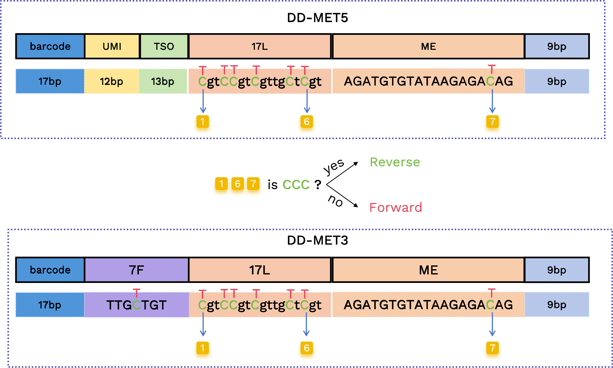
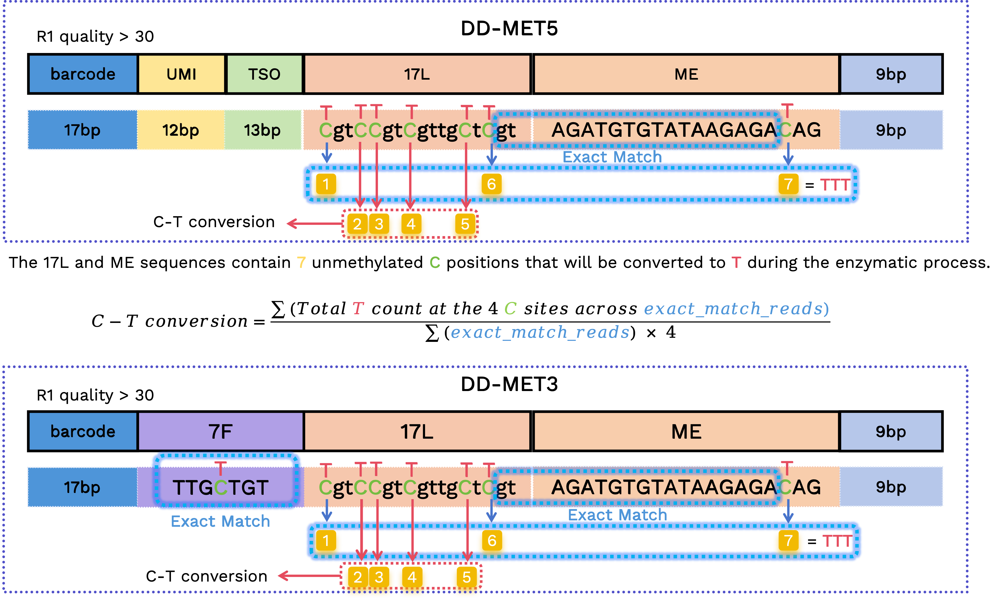
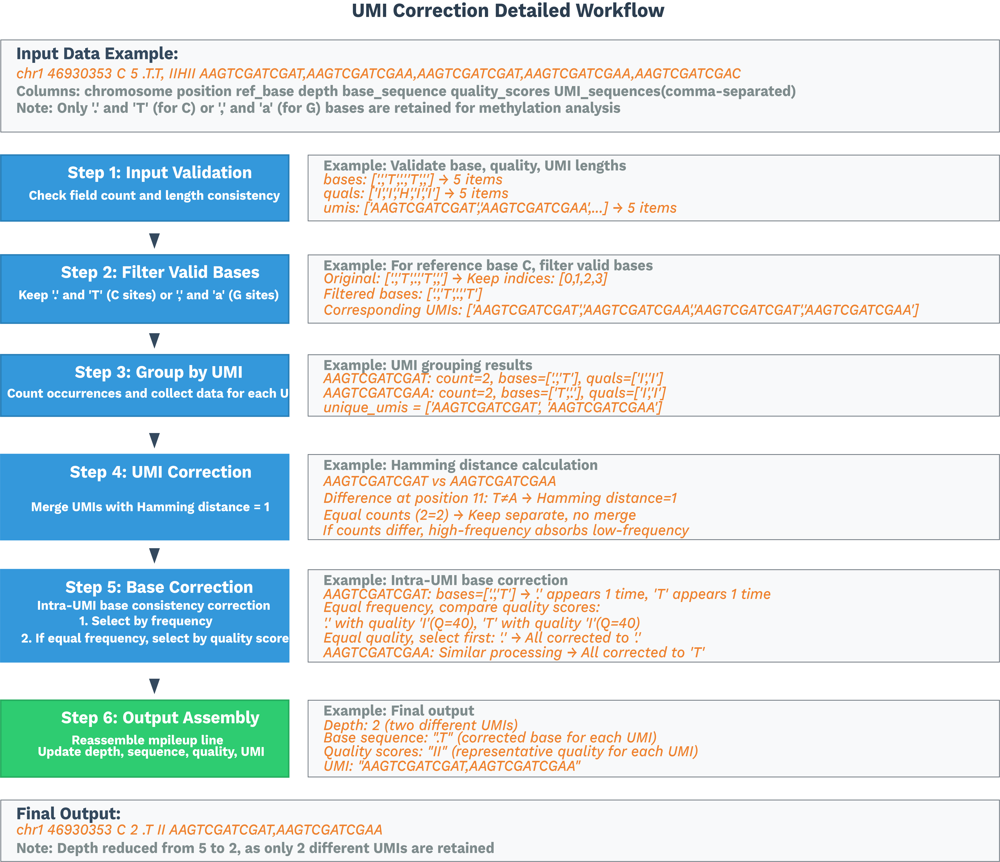

# Algorithm and Processing Details

## Process Details

### Transcriptome Processing Workflow
Transcriptome data is analyzed using [SeekSoulTools](https://github.com/seekgene/SeekSoulMethyl/tree/nf_rna_methy/dependence/seeksoultools). See the official [Algorithms Overview](https://seeksoul.online/cloudplatform-doc/en/document/Software/3_SeekSoul_Tools/1_v1.3.0a/3_Use_guide/1_rna/4_Algorithm.html) for detailed steps. Cells used in the downstream methylation library are determined based on the transcriptome library cell barcodes.

### Methylation Processing Workflow
#### Step 1: Preprocessing and Barcode Parsing
**Barcode extraction and correction**

Based on the designed structure, we locate the barcode in the read and extract the corresponding sequence. If the extracted barcode is in the whitelist, it is counted as a valid barcode; otherwise, SeekSoulMethyl attempts barcode correction, if the barcode has a one-base mismatch (Hamming distance = 1) from an entry in the whitelist:
* If exactly one whitelist candidate matches: correct the invalid barcode to that whitelist barcode.
* If multiple whitelist candidates match: correct to the candidate supported by the highest read count.

If correction fails, the read is discarded and considered a final invalid barcode read.

**UMI extraction**

UMI positions are read from the designed structure and extracted without correction.

**Forward and Reverse reads determination**

From the positions corresponding to 17L and ME, there are 7 bases that can be C or converted T (highlighted below). We use the first and the last two C/T positions to determine forward vs. reverse reads: if all three positions are C, it indicates a reverse read; otherwise, it is a forward read.

- Forward:  **T**gt**TT**gt**T**gttg**T**t**T**gtAGATGTGTATAAGAGA**T**

- Reverse:  **C**gt**CC**gt**C**gttg**C**t**C**gtAGATGTGTATAAGAGA**C**

Reverse reads correspond to CTOT/CTOB (reverse complement of the original strand) in methylation terminology; forward reads correspond to OT/OB (original strand).
The "forward" or "reverse" determination is annotated in the read name.

<figure style="text-align: center;">

<figcaption style="font-size: 0.95em; color: #666; margin-top: 4px;">Figure 3. Forward and reverse reads determination</figcaption>
</figure>

**C–T conversion rate**

We calculate the C-to-T conversion rate using the original C positions within 17L and ME sequences. Since these are fixed sequences prone to sequencing errors, we restrict the calculation to reads with verified structures:

 - In DD-MET3, the 7F sequence must be `TTGCTGT` or `TTGTTGT`, the sequence spanning 17L and ME must be `GTAGATGTGTATAAGAGA`, and the bases at first and the last two original C positions must be T.
 
 - In DD-MET5, the sequence spanning 17L and ME must be `GTAGATGTGTATAAGAGA`, and the bases at the first and last two original C positions must be T.

For the retained reads, we extract the bases at the corresponding positions to calculate the C-to-T conversion rate:

<figure style="text-align: center;">

<figcaption style="font-size: 0.95em; color: #666; margin-top: 4px;">Figure 4. CT conversion rate</figcaption>
</figure>

> [!NOTE]
> The above filtering steps are used only for calculating the C-to-T conversion rate; reads that do not meet these criteria are not filtered out from the final output FASTQ files.

**Artifact removal**

Remove TSO/7F linker, 17L and ME sequences from Read1 according to their predefined positions in the library design.

**Adapter trimming**

Use cutadapt to remove ME adapter sequences introduced by R1/R2 read-through events (overlapping paired-end reads).

**Trim 9 bp gaps introduced by Tn5 transposase**

After removing adapters and other artificial sequences, we additionally trim the 9 bp gaps flanking the inserted fragment that are introduced by Tn5 transposition. These 9 bp regions can carry artificial methylation and spuriously elevate CH methylation adjacent to the insert boundaries, so they are removed prior to downstream analysis.

**Filter reads with too many non-CpG methylated C bases (optional)**

Filter based on the number of non-CpG methylated C bases in a read pair. By default, pairs with > 2 non-CpG methylated Cs detected in read1/read2 are removed. If you do not want to enable this filter, set filter_ch to 0.

> [!NOTE]
> This filtering strategy is based on findings by Lu et al. [1], which suggest that nicks in synthesized adapters can trigger Bst polymerase nick translation. This activity incorporates 5-methyl-dCTPs, leading to completely unconverted reads that appear as artificial methylation signals.

**Filter too short reads**
After the preceding filtering and adapter trimming steps, if the length of R1 in a read pair is less than 20 bp or the length of R2 is less than 60 bp, the read pair is filtered out.

#### Step 2: Bismark alignment and sorting by name
**Alignment and tagging**

We use Bismark for methylation alignment. Our modified [Bismark](https://github.com/seekgene/Bismark.git) adds `--add_barcode` and `--add_umi` to tag BAM files by read name with CB (error-corrected barcode) and UR (raw UMI). For forward reads, we use `-X 1000` to allow insert sizes up to 1000 bp; for reverse reads, we use `--pbat` and `-X 1000`.
After alignment, sort BAMs by read name using `samtools sort -n`; the name-sorted BAMs serve as inputs for downstream analysis.

#### Step 3: ALLCools analysis

**Split by cell barcode**

Split name-sorted BAMs by RNA-derived cell barcodes into per-cell BAM files, each containing uniquely mapped reads for one cell.

**Generate ALLC files**

Sort each per-cell BAM by position and convert to ALLC using ALLCools `bam-to-allc`. Our modified ALLCools performs UR-tag-based UMI correction and deduplication per C site.

<figure style="text-align: center;">

<figcaption style="font-size: 0.95em; color: #666; margin-top: 4px;">Figure 5. UMI correction detailed diagram</figcaption>
</figure>

See the [SeekGene ALLCools repository](https://github.com/seekgene/ALLCools) for details.

**Generate MCDS**

Run `allcools generate-dataset` to bin the genome (chrom10k/20k/50k/100k/500k/1M/geneslop2k) and compute per-cell methylation matrices. Geneslop2k bins are defined as 2k bp flanking each gene.

#### Step 4: Reduction and clustering
By default, perform dimensionality reduction with LSI on chrom20k bins using ALLCools, followed by UMAP visualization.

### System Requirements
If you use `sc_methy_workflow.sh`, the system requirements are as follows:
- **CPU**: 64 cores (recommended)
- **Memory**: 128GB RAM (recommended)
- **OS**: Linux (recommended Ubuntu 18.04+ or CentOS 7+)

## Nextflow Step-by-Step Details

This section describes each Nextflow process with inputs, core logic, key parameters, and outputs for troubleshooting and interpretation. The workflow is defined in `nf/main.nf` and processes are implemented in `nf/modules/*.nf`.

### Step 1: Preprocessing and Barcode Parsing (step1.nf)
- Compute genome-wide CpG count: `COMPUTE_CPG_SITES`
  - Input: `params.genomefa`, `params.chrom_size_path`
  - Action: run `count_cg_sites.py` to count CpG sites
  - Output: `genome_cg_info.json`

- Expression FASTQ QC (multi-group): `FASTP_EXPRESSION_MULTI`
  - Input: paired FASTQs per sample (groups G1/G2/...)
  - Action: `fastp` trimming and QC
  - Output: cleaned `*_expression_clean_R1/2.fastq.gz`, `*.html`, `*.json`

- Methylation FASTQ QC (multi-group): `FASTP_METHYLATION_MULTI`
  - Input: paired FASTQs per sample (groups G1/G2/...)
  - Action: `fastp` QC (adapter detection disabled, trimming as per pipeline)
  - Output: cleaned `*_methylation_clean_R1/2.fastq.gz`, `*.html`, `*.json`

- RNA alignment and quantification: `SEEKSOULTOOLS_RNA`
  - Input: cleaned expression R1/R2 lists
  - Action: `seeksoultools rna run` (STAR mapping, counting, filtering, clustering, DE)
  - Output: `Analysis/step3/filtered_feature_bc_matrix/` etc.

- Methylation barcode parsing: `METHYLATION_BARCODE_EXTRACTION`
  - Input: cleaned methylation R1/R2 lists, whitelist `params.methy_barcode_wl`
  - Action: run `barcode_cs_multi.py` to parse/correct cell barcodes and UMIs by `params.chemistry`; optional `--split_fastq n` to shard reads by first n barcode bases
  - Output: `step1/${sample}_forward_*{1,2}.fq.gz`, `step1/${sample}_reverse_*{1,2}.fq.gz`, `${sample}_methy_summary.json`, optional `${sample}_barcode_stats.txt`

- Build forward/reverse pairing lists: `PARSE_FASTQ_FILES`
  - Input: forward/reverse FASTQ sets
  - Action: scan `step1/` and pair files by identifiers
  - Output: `forward_pairs.txt`, `reverse_pairs.txt`

- Post-barcode-extraction QC: `FASTP_METHYLATION_BARCODE_EXTRACT`
  - Input: paired sub-FASTQs
  - Action: `fastp` QC
  - Output: per-pair `*.html`, `*.json`

### Step 2: Bismark alignment and BAM sorting (step2.nf)
- Forward-strand alignment: `BISMARK_ALIGNMENT_FORWARD`
  - Key flags: `--add_barcode`, `--add_umi`; max insert size `-X 1000`
  - Output: `*_bismark_bt2_pe.bam`, `*_bismark_bt2_PE_report.txt`

- Reverse (PBAT) alignment: `BISMARK_ALIGNMENT_REVERSE`
  - Key flags: `--pbat`, `--add_barcode`, `--add_umi`
  - Output: same as above

- Sort by read name: `SORT_BAM_BY_NAME`
  - Action: `samtools sort -n`
  - Output: `*_sortbyname.bam`

### Step 3: Per-cell split, ALLC generation/merge, dataset building (step3.nf)
- Split BAMs by cell barcode: `SPLIT_BAM_FILES`
  - Input: name-sorted BAM and GEX barcodes `barcodes.tsv.gz`
  - Action: run `step3_split_bams.py` to split by cell barcode and keep shared cells only
  - Output: per-cell BAM dir, `*_filtered_barcode`, `*_filtered_barcode_reads_counts.csv`

- Merge forward/reverse per-cell BAMs and counts: `MERGE_BISMARK_BAM`
  - Action: `samtools merge -n` per matching cell; merge/deduplicate barcodes and read counts
  - Output: `*_merged_fr_bam/`, `*_merge_filtered_barcode`, `*_merge_filtered_barcode_reads_counts.csv`

- Generate per-cell ALLC: `ALLCOOLS_BAM_TO_ALLC`
  - Action: run `step3_bam_to_allc.py` (custom ALLCools), UR-based dedup and methylation quantification
  - Output: per-cell `*_allc.gz` and index

- Merge cell metrics: `MERGE_FILTERED_BARCODE_READS_COUNTS`
  - Action: merge barcodes and read counts, create `${sample}_cells.csv` and `.json`
  - Output: `filtered_barcode`, `filtered_barcode_reads_counts.csv`, `${sample}_cells.{csv,json}`

- Build multi-scale dataset: `ALLCOOLS_GENERATE_DATASETS`
  - Action: `allcools generate-dataset` for chrom10k/20k/50k/100k/500k/1M, metrics like `count` and `hypo-score`
  - Output: `${sample}.mcds`

- Merge ALLC (when sharded): `ALLCOOLS_SUBMERGE`, `ALLCOOLS_MERGE`
  - Action: merge per-shard/per-sample ALLCs
  - Output: `${sample}_merge_allc.gz` and index

- Extract CG context ALLC: `ALLCOOLS_EXTRACT`
  - Action: `allcools extract-allc --mc_contexts CGN --strandness merge`
  - Output: `*.CGN-Merge*`

(Methylation-only workflow `methy_only.nf` additionally includes `COUNTS_MAPPED_READS` and `ESTIMATED_CELLS` for read-count-based cell estimation and barcode filtering)

### Step 4: Summary, DR & joint report (step4.nf)
- Methylation summary: `METHYLATION_SUMMARY`
  - Action: `step4_wgs_summary.py` aggregates Bismark reports, cell metrics and CpG stats to produce `${sample}_methy_summary.json` and `${sample}_wgs_summary.csv`

- LSI/PCA clustering and visualization: `METHYLATION_LSI_PCA_CLUSTERING`
  - Action: `step4_allcools_PCA_cluster.py --var_dim chrom20k --reduc lsi`
  - Output: `*.h5ad`, `*.pdf`, `*.png`

- Transcriptome+Methylation joint report: `MULTI_REPORT`
  - Action: `step4_report_rna_met.py` integrates transcriptome and methylation outputs
  - Output: `${sample}_rna_methyl_report.html`, `${sample}_rna_met.json`
