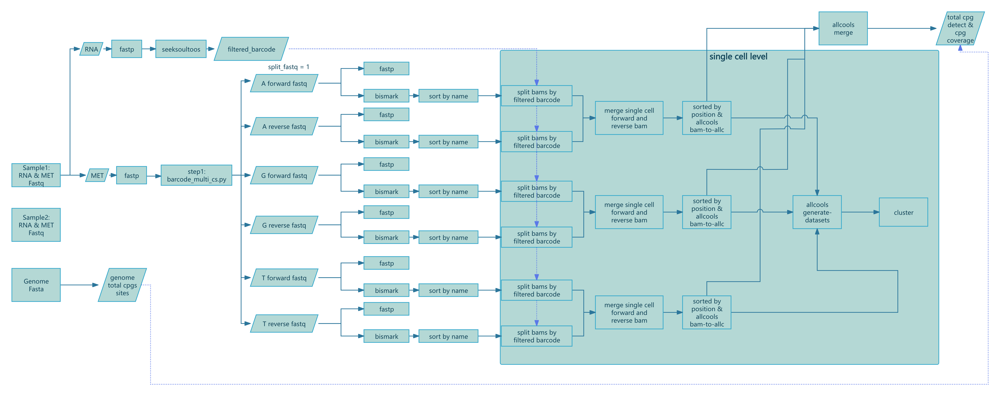

# Usage

## Usage


### Activate Environment
```bash
conda activate seeksoulmethyl
```

### Run Dual-omics Analysis (Shell script)
```bash
# sc_methy_workflow.sh can be found in the SeekSoulMethyl directory you cloned
bash sc_methy_workflow.sh \
/path/to/expression_R1.fastq.gz \
/path/to/expression_R2.fastq.gz \
/path/to/methy_R1.fastq.gz \
/path/to/methy_R2.fastq.gz \
--sample WTJW880 \
--outdir /path/to/results \
--database_dir /path/to/human-reference-GRCh38 \
--chemistry DD-MET5 \
--core 64 \
--filter_ch 2
```
If a sample has multiple datasets, separate file paths with commas. Ensure that the FASTQ files are listed in the correct order for each dataset.
```shell
bash sc_methy_workflow.sh \
/path/to/WTJW969_E_L003_R1.fq.gz,/path/to/WTJW969_E_L004_R1.fq.gz \
/path/to/WTJW969_E_L003_R2.fq.gz,/path/to/WTJW969_E_L004_R2.fq.gz \
/path/to/WTJW969_Met_L000_R1.fq.gz,/path/to/WTJW969_Met_L001_R1.fq.gz,/path/to/WTJW969_Met_L002_R1.fq.gz,/path/to/WTJW969_Met_L003_R1.fq.gz,/path/to/WTJW969_Met_L004_R1.fq.gz \
/path/to/WTJW969_Met_L000_R2.fq.gz,/path/to/WTJW969_Met_L001_R2.fq.gz,/path/to/WTJW969_Met_L002_R2.fq.gz,/path/to/WTJW969_Met_L003_R2.fq.gz,/path/to/WTJW969_Met_L004_R2.fq.gz \
--sample WTJW969 \
--outdir /path/to/results \
--database_dir /path/to/human-reference-GRCh38 \
--chemistry DD-MET5 \
--core 64 \
--filter_ch 2
```

### Input Parameters:

- **$1**: Single-cell transcriptome Read1 fastq file path.
- **$2**: Single-cell transcriptome Read2 fastq file path.
- **$3**: Single-cell methylation Read1 fastq file path.
- **$4**: Single-cell methylation Read2 fastq file path.
- **sample**: Sample name.
- **outdir**: Output directory path.
- **database_dir**: Reference genome database path.
- **chemistry**: Methylation chemistry (DD-MET3 or DD-MET5; default: DD-MET5). DD-MET3 is a dual-label dataset, meaning the RNA and DNA methylation data barcodes are different for the same cell, while DD-MET5 is single-label, meaning the RNA and DNA methylation data barcodes are the same for the same cell.
- **core**: Number of CPU cores.  
- **filter_ch**: Filter reads that contain > n CH methylation sites. If you do not want to enable this filter, set filter_ch to 0.

## Running with Nextflow (Recommended)


If you want to process samples in batch and get pipeline-level reports, use Nextflow:

<figure style="text-align: center;">

<figcaption style="font-size: 0.95em; color: #666; margin-top: 4px;">Figure 6. SeekSoulMethyl nextflow pipeline workflow</figcaption>
</figure>

1. Install nextflow:
```bash
conda install -n seeksoulmethyl -c bioconda nextflow
```
2. Prepare your input samplesheet
```
cat > samplelist.csv << EOF
sample_id,expression_r1,expression_r2,methylation_r1,methylation_r2
XYRD-WTJW880,/path/to/XYRD-WTJW880-E_S1_L005_R1_001.fastq.gz,/path/to/XYRD-WTJW880-E_S1_L005_R2_001.fastq.gz,/path/to/XYRD-WTJW880-MET_S01_L001_R1_001.fastq.gz,/path/to/XYRD-WTJW880-MET_S01_L001_R2_001.fastq.gz
EOF

# expression_r1: Single-cell transcriptome Read1 fastq file
# expression_r2: Single-cell transcriptome Read2 fastq file
# methylation_r1: Single-cell methylation Read1 fastq file
# methylation_r2: Single-cell methylation Read2 fastq file
```

If a single sample has multiple datasets and the transcriptome and methylation FASTQ counts do not match (e.g., WTJW969), add multiple rows to the samplesheet, with each row representing one dataset.
```text
sample_id,expression_r1,expression_r2,methylation_r1,methylation_r2
WTJW969,/path/to/WTJW969_E_L003_R1.fq.gz,/path/to/WTJW969_E_L003_R2.fq.gz,/path/to/WTJW969_Met_L000_R1.fq.gz,/path/to/WTJW969_Met_L000_R2.fq.gz
WTJW969,/path/to/WTJW969_E_L004_R1.fq.gz,/path/to/WTJW969_E_L004_R2.fq.gz,/path/to/WTJW969_Met_L001_R1.fq.gz,/path/to/WTJW969_Met_L001_R2.fq.gz
WTJW969,,,/path/to/WTJW969_Met_L002_R1.fq.gz,/path/to/WTJW969_Met_L002_R2.fq.gz
WTJW969,,,/path/to/WTJW969_Met_L003_R1.fq.gz,/path/to/WTJW969_Met_L003_R2.fq.gz
WTJW969,,,/path/to/WTJW969_Met_L004_R1.fq.gz,/path/to/WTJW969_Met_L004_R2.fq.gz
```

3. Run the pipeline:
```bash
nextflow run -bg SeekSoulMethyl/nf/main.nf \
--outdir /path/to/tiny_demo/results/ \
--samplesheet samplelist.csv \
-w /path/to/tiny_demo/results/work \
-c SeekSoulMethyl/nf/nextflow.config \
-profile aliyun_k8s \
--database_dir /path/to/human-reference-GRCh38/ \
--split_fastq 1 \
--filter_ch 2 \
--chemistry DD-MET5 > methy.log

# --outdir: final results directory
# --samplesheet: input samplesheet file
# -w: working directory for nextflow
# -c: nextflow configuration file. Must be modified according to your server configuration.
# -profile: nextflow profile for aliyun k8s
# --database_dir: reference genome database directory
# --split_fastq: To speed up the analysis process, split fastq according to first n bases of barcode. Default is 4.
# --filter_ch: filter reads that contain > 2 CH methylation sites.
# --expected_cell_num: expected number of cells used by methy_only cell estimation. Default is 3000.
# --chemistry: methylation chemistry (DD-MET3 or DD-MET5; default: DD-MET5)
```

### Notes on nextflow.config

`nextflow.config` declares the execution environment, resource quotas, and run policies. You must customize it to your own server or cluster.

- Location: `SeekSoulMethyl/nf/nextflow.config` (specify with `-c SeekSoulMethyl/nf/nextflow.config` when running).
- Key items to tailor to your infrastructure:
  - Executor: `process.executor` (e.g., `local`, `slurm`, `pbs`, `k8s`, `awsbatch`).
  - Resources: `process.cpus`, `process.memory`, `process.time`, or fine-grained overrides via `withLabel`/`withName`.
  - Work directory: `workDir` (can also be set via `-w`); ensure it is writable and has sufficient space.
  - Environment: enable one of `conda.enabled`, `docker.enabled`, or `singularity.enabled` according to what your server supports.

Example configurations (replace paths and parameters with values valid on your servers):

```groovy
profiles {
  // Local machine
  local {
    process.executor = 'local'
    workDir          = '/path/to/work'
    process.cpus     = 8
    process.memory   = '32 GB'
    conda.enabled    = true
    // Or containers: singularity.enabled = true / docker.enabled = true
  }

  // Slurm cluster (HPC)
  slurm {
    process.executor   = 'slurm'
    workDir            = '/lustre/work/your_user'
    process.cpus       = 8
    process.memory     = '32 GB'
    process.queue      = 'normal'
    process.clusterOptions = '-A your_account --qos=normal'

    withLabel: 'high_mem' {
      cpus   = 16
      memory = '64 GB'
    }
  }

  // Kubernetes (e.g., Alibaba Cloud ACK)
  aliyun_k8s {
    process.executor   = 'k8s'
    workDir            = '/mnt/nf-work'    // persistent volume path
    k8s {
      namespace        = 'your-namespace'
      storageClaimName = 'your-pvc'
      cpu              = 4
      memory           = '16 GB'
    }
    // If using container images globally: docker.enabled = true
  }
}
```

Tips:
- Pick the `-profile` that matches your environment (e.g., `slurm`, `local`, `aliyun_k8s`), then adapt the parameters.
- Keep `workDir` on fast storage with ample capacity; the final results directory is controlled by `--outdir`.
- If you use the README’s conda environment, prefer `conda.enabled`; if your cluster favors containers, use Docker/Singularity.

References:
- Nextflow configuration & profiles: https://www.nextflow.io/docs/latest/config.html
- Executors (local, Slurm, K8s, etc.): https://www.nextflow.io/docs/latest/executor.html
- Kubernetes guide: https://www.nextflow.io/docs/latest/kubernetes.html

## Methylation-only workflow (test version, currently not recommended for use)

Use the simplified workflow when you only have methylation reads:
```bash
nextflow run SeekSoulMethyl/nf/main.nf \
  --workflow methy_only \
  --outdir /path/to/results \
  --samplesheet samplelist.csv \
  -w /path/to/work \
  -c SeekSoulMethyl/nf/nextflow.config \
  -profile aliyun_k8s \
  --database_dir /path/to/reference \
  --split_fastq 4 \
  --filter_ch 2 \
  --chemistry DD-MET5
```

## Key parameters and tips

- `--database_dir`: reference directory with `fasta/genome.fa`, `genes/genes.gtf`, `star/`, `bed/chr_nochrM.bed` 
- `--chemistry`: `DD-MET3` or `DD-MET5` (default: `DD-MET5`); also sets transcriptome chemistry and barcode whitelist
- `--split_fastq`: shard by the first n barcode bases (default 4; increases parallelism but adds scheduling/merge overhead) 
- `--filter_ch`: filter reads with > n CH methylation sites (default 2).  If you do not want to enable this filter, set `filter_ch` to 0.
- The samplesheet header must be `sample_id`

## Execution environment and resources

- `-profile docker` uses the public container image `ghcr.io/seekgene/seeksoulmethyl_docker:v1.0.0`.
- `-profile aliyun_k8s` and `-profile aliyun_k8s_argo` use the internal Aliyun registry image `seekgene-registry-vpc.cn-beijing.cr.aliyuncs.com/seekgene/seeksoulmethyl:1.1.2`, which is maintained for SeekGene's Kubernetes environment.
- Choose the profile that matches your infrastructure, and edit `nf/nextflow.config` if you need to mirror or replace either image.
- Heavy steps: Bismark/ALLCools need substantial CPU/RAM; defaults are set in `withName` blocks, scale up if needed 
